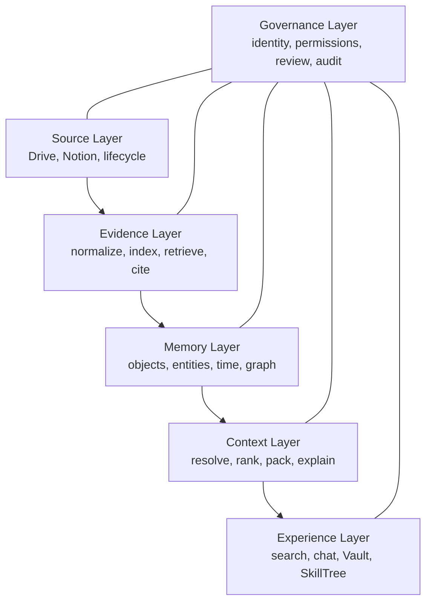

# RekanVault Product Build Plan

> **RekanVault — Living Knowledge, Evidence, Memory, and Skill System**  
> One source-connected workspace that retrieves what the evidence says, remembers what the organization knows, and makes both usable by humans and AI.

| Field | Value |
|---|---|
| Document status | Canonical Product and Implementation Plan |
| Plan version | 0.2 |
| Created | 31 July 2026 |
| Last updated | 31 July 2026 |
| Owner | Ibrahim Muhammad Isa (Imi) |
| Product | RekanVault |
| Repository | `rekan-vault` |
| Product stage | Pre-alpha; source connector foundation validated |
| First-release sources | Google Drive and Notion |
| Initial deployment target | One modular deployment on an approximately 8 GB VPS |

---

## 1. Locked Product Decision

RekanVault is one product.

It owns the complete knowledge loop:

1. Connect authorized sources.
2. Detect and process source changes.
3. Normalize and index content.
4. Retrieve exact evidence with citations.
5. Form durable memories from evidence and direct contributions.
6. Connect entities, decisions, skills, projects, and history.
7. Assemble current, permission-aware context.
8. Expose that context through search, grounded chat, graph navigation, and SkillTree.
9. Learn from corrections, reviews, and outcomes.

The product is internally modular, but it has:

- One product identity.
- One repository.
- One deployment model.
- One authorization and permission system.
- One canonical document identity.
- One coordinated data architecture.
- One roadmap.
- One human workspace.

### Non-negotiable internal separation

One product does not mean one undifferentiated data model.

RekanVault keeps four forms of information distinct:

| Information form | Meaning | Source of truth |
|---|---|---|
| Canonical source | The original Drive or Notion object | Original source system |
| Normalized source record | Versioned, extracted representation of the source | PostgreSQL and normalized artifact storage |
| Retrieval derivative | Rebuildable chunk, lexical record, embedding, or index payload | Rebuilt from normalized source records |
| Institutional memory | Typed, temporal, evidence-linked organizational knowledge | PostgreSQL |

This separation preserves provenance, recovery, permission enforcement, and safe invalidation without creating separate products.

---

## 2. Product Definition

RekanVault is a source-connected knowledge system that transforms living organizational data into:

- Reliable evidence.
- Durable institutional memory.
- A temporal knowledge graph.
- Bounded context for AI.
- A navigable human workspace.
- Evidence-backed SkillTrees.

RekanVault is not merely a file search engine, a vector database, a note-taking tool, or a chatbot. Its product value comes from joining those capabilities into one governed knowledge lifecycle.

### Core promise

> Connect the places where knowledge already lives, then make their evidence, meaning, relationships, history, and skills continuously usable.

### Primary product outputs

1. **Evidence packets**  
   Ranked passages with exact source, version, locator, freshness, permission, retrieval, and confidence metadata.

2. **Memory objects**  
   Typed records such as decisions, claims, facts, people, organizations, projects, policies, risks, lessons, ideas, procedures, and skills.

3. **Context packs**  
   Query- or task-specific bundles containing current memories, relationships, history, exact evidence, contradictions, and uncertainty within a defined budget.

4. **Grounded answers**  
   Human-readable answers generated from an authorized context pack, with citations and explicit insufficient-evidence behavior.

5. **Knowledge views**  
   Search results, pages, backlinks, collections, decision timelines, graph neighborhoods, source inspectors, and activity history.

6. **SkillTree views**  
   Capabilities, prerequisites, progress, evidence, projects, learning resources, gaps, and next-step paths.

---

## 3. Problem Statement

Organizations accumulate files, notes, chats, decisions, research, project records, and operational data without maintaining a reliable system for meaning and continuity.

Common failures include:

- Initial imports work, but updates, moves, deletions, and lost access do not converge.
- Search finds words without explaining current organizational context.
- Vector search returns semantically similar passages that are not decisive or current.
- Decisions are remembered without rationale, alternatives, evidence, or reversal history.
- Old conclusions remain visible after being superseded.
- Generated summaries become indistinguishable from source-authored material.
- People, projects, risks, lessons, policies, and outcomes remain disconnected.
- The same research and reasoning are repeated.
- Knowledge remains attached to individuals rather than the institution.
- AI receives isolated chunks instead of current, structured, permission-aware context.
- Skills are listed without proof, prerequisites, projects, or learning history.
- Corrections and source changes do not propagate to derived knowledge.
- Permission boundaries disappear during indexing, graph traversal, or synthesis.

RekanVault addresses these failures through one lifecycle from source synchronization to evidence, memory, context, and human use.

---

## 4. Target Users

### Primary users

| User | Primary job |
|---|---|
| Leaders and decision-makers | Retrieve current decisions, rationale, risks, dependencies, and historical context. |
| Knowledge workers | Capture, find, connect, and reuse research, notes, lessons, people, topics, and projects. |
| Project and operations teams | Understand what changed, what was decided, what remains unresolved, and why. |
| Learners and capability managers | Navigate evidence-backed skills, prerequisites, progress, and learning paths. |
| AI agents and applications | Receive bounded evidence and context through stable APIs. |
| Knowledge administrators | Manage sources, sync health, schemas, review queues, entity merges, permissions, and audit. |

### First-release operating profile

- One organization or workspace.
- A small authorized team.
- One or more selected Drive folders.
- One or more selected Notion roots or data sources.
- Text-first corpus.
- Indonesian and English content must be preserved correctly.
- Self-hosted or operator-managed deployment.

---

## 5. Jobs to Be Done

RekanVault must let an authorized user or agent:

1. Connect selected Google Drive and Notion scopes.
2. Import their current authorized content.
3. Detect additions, edits, moves, renames, trash, restoration, deletion, and access loss.
4. Search exact terms, concepts, entities, relationships, time periods, and statuses.
5. Retrieve the strongest passages with stable citations.
6. Ask a question and receive a grounded answer or an explicit insufficient-evidence result.
7. Convert source-backed material into typed, evidence-linked memories.
8. Record decisions directly with rationale, alternatives, owner, status, and review conditions.
9. Resolve aliases into canonical people, organizations, projects, topics, assets, and skills.
10. Browse links, backlinks, graph neighborhoods, and timelines.
11. Distinguish current, historical, disputed, inferred, and superseded knowledge.
12. Detect when a source update invalidates or changes derived memory.
13. Submit corrections, confirmations, feedback, and observed outcomes.
14. Build SkillTrees connected to evidence, experience, projects, and resources.
15. Audit who or what created, changed, verified, merged, or superseded knowledge.
16. Recover after missed events, worker downtime, or vector-index loss.

---

## 6. Product Principles

1. **Evidence before synthesis**  
   Source, version, locator, and permission remain visible beneath every source-backed claim.

2. **One product, modular intelligence**  
   Source, evidence, memory, graph, context, experience, and governance are internal boundaries, not separate products.

3. **Living means lifecycle-complete**  
   Reliability includes updates, moves, deletion, permission loss, missed events, reconciliation, and rebuild.

4. **Current truth does not erase history**  
   Superseded and reversed states remain auditable while the current state is clear.

5. **Memory is typed**  
   A decision, claim, project, risk, procedure, lesson, and skill are not interchangeable notes.

6. **Time is first-class**  
   Occurred, recorded, effective, observed, superseded, expiry, and review times are distinct.

7. **Relationships carry meaning**  
   Edges are typed, temporal, evidence-linked, permission-aware, and explainable.

8. **Generated content is never silent truth**  
   Source-authored, human-authored, agent-authored, inferred, transformed, and externally verified origins remain explicit.

9. **Context is assembled, not dumped**  
   Humans and AI receive the smallest sufficient set of evidence and memory for a task.

10. **Permissions propagate**  
    A derivative can never become more permissive than the source evidence supporting it.

11. **Human review is risk-based**  
    Low-risk deterministic processing may automate; uncertain or high-impact knowledge enters review.

12. **Graph value must be practical**  
    Graphs improve navigation, explanation, temporal reasoning, context, and skills—not merely node count.

13. **Indexes are disposable**  
    Vector and lexical indexes are rebuildable derivatives, never the authoritative record.

14. **Model and vendor independence**  
    Extractors, embeddings, rerankers, vector stores, and language models remain replaceable.

15. **Open and self-hostable core**  
    Core operation must not require a mandatory paid managed service.

16. **Recoverability over cleverness**  
    Every derived state has a deterministic rebuild or reconciliation path.

---

## 7. Product Architecture



### 7.1 Source Layer

Owns:

- Source registration and authorization references.
- Initial scans and incremental synchronization.
- Provider event verification.
- Scheduled reconciliation.
- Stable source, document, and version identities.
- Source hierarchy, metadata, permissions, and lifecycle state.
- Format extraction and normalized source records.

### 7.2 Evidence Layer

Owns:

- Deterministic chunking.
- Lexical and semantic representations.
- Active-version index lifecycle.
- Hybrid retrieval.
- Filtering, fusion, reranking, and deduplication.
- Evidence sufficiency and contradiction signals.
- Citation resolution.
- Evidence packets.

### 7.3 Memory Layer

Owns:

- Typed memory objects.
- Entity resolution and aliases.
- Typed relations.
- Decision and temporal history.
- Source-to-memory lineage.
- Review, verification, correction, supersession, and invalidation.
- Feedback and outcome links.

### 7.4 Context Layer

Owns:

- Intent and entity resolution.
- Memory and evidence retrieval coordination.
- Bounded graph expansion.
- Current-state resolution.
- Contradiction and uncertainty detection.
- Token or item budgeting.
- Context-pack assembly.
- Grounded-answer preparation and citation validation.

### 7.5 Experience Layer

Owns:

- Source onboarding.
- Global search.
- Grounded chat.
- Vault pages and collections.
- Evidence inspector.
- Links and backlinks.
- Decision timeline.
- Graph explorer.
- Review queue.
- SkillTree.
- Administrative and health views.

### 7.6 Governance Layer

Owns:

- Workspace isolation.
- Actor identity and roles.
- Corpus and object permissions.
- Derived-permission propagation.
- Secret handling.
- Review policy.
- Audit.
- Retention, export, backup, and recovery policy.

---

## 8. First Release Definition

The first release is a usable, integrated vertical slice rather than a collection of disconnected infrastructure modules.

### 8.1 First-release user outcome

An authorized user can:

1. Connect Drive and Notion.
2. See successful synchronization and source health.
3. Search or ask questions across both sources.
4. Open exact citations.
5. View extracted decisions, claims, entities, projects, topics, risks, lessons, and skills.
6. Correct or approve uncertain memories.
7. Browse backlinks, a bounded graph, and decision history.
8. Create direct structured memories.
9. Build and inspect a basic evidence-backed SkillTree.
10. Observe a source change propagate through retrieval and memory state.

### 8.2 Included scope

- One workspace.
- Google Drive and Notion.
- Google Docs, text PDFs, Markdown, TXT, DOCX, Notion pages, nested blocks, data-source schemas, and row pages.
- Text-first extraction.
- Initial and incremental synchronization.
- Lifecycle convergence and reconciliation.
- PostgreSQL control plane and institutional-memory source of truth.
- PostgreSQL full-text retrieval.
- Qdrant dense retrieval.
- Hybrid fusion and reranking.
- Evidence packets and exact citations.
- Grounded search and chat.
- Core memory types and direct-write templates.
- Entity resolution, aliases, typed relationships, and temporal state.
- Context packs.
- Minimal but complete human workspace.
- Basic SkillTree.
- Viewer, contributor, reviewer, and administrator roles.
- Audit and permission foundation.
- Import, export, rebuild, and operational diagnostics.

### 8.3 Explicitly deferred

- Exact end-user ACL mirroring for every provider object.
- Spreadsheet cell-level ingestion.
- Slide-level extraction.
- OCR for scanned files.
- Audio and video transcription.
- Governed web research. *(Planned post-P7 — an agentic consumer of the retrieval/memory/answer pipeline, not a prerequisite.)*
- Automatic actions in external systems.
- Multiple organizations with workload isolation.
- A dedicated graph database.
- Unbounded autonomous agents.
- Native editing of canonical Drive or Notion documents.
- Large-scale analytics and billing.

---

## 9. Source Requirements

### 9.1 Google Drive

The first release must support:

- OAuth authorization through a configured Google Cloud application.
- One account or authorized Drive scope per source connection.
- One or more selected folders as roots.
- Recursive authorized-folder scanning.
- Capture of a Changes-feed token before the initial scan completes.
- Ordered incremental synchronization through the Drive Changes feed.
- Scheduled authoritative reconciliation.
- Google Docs export to text with useful structure.
- Download and extraction of supported blob formats.
- Stable document identity through rename and move.
- Trash, restoration, deletion, movement outside scope, and access-loss handling.
- Permission fingerprinting at the implemented scope.
- Provider throttling, retry, and durable job checkpoints.

### 9.2 Notion

The first release must support:

- One or more integration connections with explicitly shared roots.
- Selected root pages and data sources.
- Recursive page and nested-block traversal.
- Child-page discovery.
- Data-source schemas and row pages.
- Signed webhook verification for change signals.
- Refetch after webhook signals because event payloads are not canonical content.
- Last-edited-time safety polling.
- Scheduled authoritative reconciliation.
- Archive, restoration, permission loss, and removal handling.
- Stable provider identity and hierarchy.
- Attachment links preserved as source references.

Notion attachments are not recursively downloaded in the first release.

### 9.3 Source lifecycle

Required transitions:

- Create.
- Update.
- Rename.
- Move.
- Move into scope.
- Move outside scope.
- Trash or archive.
- Restore.
- Delete.
- Permission change.
- Access revocation.
- Reindex.
- Reconcile.

### 9.4 Convergence rules

- Rename and move preserve `document_id`.
- Content or extraction-relevant changes create immutable `version_id` values.
- Unchanged fingerprints do not create duplicate versions.
- Only one active version exists per document within a corpus.
- A new active version atomically deactivates the prior version's derivatives.
- Trash, delete, or access revocation blocks new retrieval immediately.
- Provider events may be duplicated, delayed, or out of order without corrupting final state.
- Reprocessing is idempotent.
- Scheduled reconciliation repairs missed provider events.
- Workers resume from durable checkpoints.

---

## 10. Normalized Document Model

Every supported source object becomes a provider-neutral normalized document.

| Group | Required data |
|---|---|
| Identity | Workspace, source, corpus, document, provider object, and immutable version IDs. |
| Source | Provider, source type, MIME type, canonical URL, parent, hierarchy, and path. |
| Description | Title, owner or author where available, created, modified, observed, extracted, and indexed times. |
| State | Active, trashed, archived, deleted, inaccessible, or failed; permission fingerprint. |
| Content | Ordered normalized blocks with format-aware locators. |
| Integrity | Source fingerprint, content fingerprint, extractor and schema versions. |
| Quality | Extraction status, warnings, completeness, unsupported elements, and confidence where meaningful. |
| Origin | Source-authored, human-authored, agent-authored, inferred, transformed, or externally verified. |
| Lineage | Parent, prior version, attachment references, derived assets, and transformation references. |

### Locator requirements

A locator must:

- Resolve to a source location where technically possible.
- Be specific enough to support a claim.
- Remain stable across a normal reindex.
- Record when only file-level citation is possible.

Examples:

- Google Doc heading path and character span.
- PDF page and text span.
- Markdown heading path and block index.
- Notion block ID and ancestor path.

---

## 11. Evidence and RAG Requirements

### 11.1 Index preparation

- Structure-aware deterministic chunking.
- Stable `chunk_id` from document version, locator, and chunking policy.
- PostgreSQL lexical representation.
- Qdrant dense representation.
- Payload filters for workspace, corpus, source, state, type, time, origin, and permission.
- Recorded extractor, chunker, embedding, and index versions.
- Version-aware upsert, deactivate, delete, and rebuild.

### 11.2 Query pipeline

1. Authenticate the requester.
2. Resolve workspace, corpus, and permission scope.
3. Classify the request as source search, memory search, contextual question, or mixed request.
4. Normalize the query and filters.
5. Run lexical and dense retrieval in parallel.
6. Filter to current authorized versions.
7. Fuse ranked lists.
8. Rerank eligible candidates.
9. Deduplicate overlapping passages.
10. Assess relevance, freshness, extraction quality, contradiction, and sufficiency.
11. Assemble an evidence packet.
12. Record redacted diagnostic metadata.

### 11.3 Evidence packet

An evidence packet contains:

- Request ID and authorized scope.
- Query and filters.
- Ranked passages.
- Stable source, document, version, and chunk identities.
- Format-aware locator and canonical URL.
- Lexical, dense, fusion, reranking, and final scores where available.
- Retrieval strategy and component versions.
- Source observation and indexing times.
- Origin and transformation lineage.
- Permission decision reference.
- Sufficiency, freshness, contradiction, extraction-quality, and warning signals.

### 11.4 Insufficient-evidence behavior

The system must return a typed insufficient-evidence result when:

- No eligible material is found.
- Results are below the calibrated relevance threshold.
- Evidence is stale for a time-sensitive request.
- Available content is inaccessible.
- Extraction quality is too low.
- Sources materially conflict and no current authoritative state can be resolved.

The answer layer must not compensate by inventing support.

### 11.5 Grounded answer contract

Every generated answer includes:

- Answer text.
- Claim-to-citation mapping.
- Evidence and context-pack IDs.
- Effective time or freshness statement where relevant.
- Explicit uncertainty and contradiction.
- Model and prompt-version diagnostics for audit.
- Refusal or insufficient-evidence state when grounding fails.

---

## 12. Memory Model

### 12.1 Core memory types

| Type | Purpose |
|---|---|
| Fact | A source-supported statement treated as currently valid. |
| Claim | A statement that may be supported, disputed, or unresolved. |
| Decision | A choice with alternatives, rationale, owner, status, and evidence. |
| Policy | A governing rule, authority, scope, exceptions, and effective period. |
| Procedure | A repeatable method with trigger, steps, roles, inputs, and outputs. |
| Event | Something that happened at a defined time. |
| Project | A bounded initiative with goal, owner, status, milestones, risks, and outcomes. |
| Task | An actionable unit with assignee, due date, status, and dependencies. |
| Idea | A proposal with problem, hypothesis, status, and potential impact. |
| Risk | A possible adverse condition with likelihood, impact, trigger, mitigation, and owner. |
| Assumption | A condition treated as true with basis, confidence, and invalidation rule. |
| Lesson | Reusable learning from evidence or experience. |
| Metric | A defined measure, value, period, target, and source. |
| Person | A canonical human entity with names, roles, affiliations, and active periods. |
| Organization | A canonical organization with aliases, type, units, and active periods. |
| Topic | A navigational concept with aliases, parents, and related topics. |
| Asset | A product, system, property, corpus, or managed object. |
| Skill | A capability with levels, prerequisites, evidence rules, and progress. |

### 12.2 Common memory fields

Every memory has:

- Stable `memory_id`.
- Type and schema version.
- Workspace and permission scope.
- Origin and author or producing pipeline.
- Created, recorded, observed, effective, expiry, review, and superseded times where relevant.
- Lifecycle and review state.
- Confidence and impact classification.
- Evidence anchors when source-backed.
- Relations to entities and other memories.
- Status history.
- Audit history.

### 12.3 Origin types

- Source-derived.
- Human-authored.
- Agent-authored.
- Structured-event import.
- Inferred.
- Synthesized.
- Corrected.
- Externally verified.

Origin never substitutes for confidence or verification.

### 12.4 Review states

- Draft.
- Candidate.
- Verified.
- Disputed.
- Superseded.
- Reversed.
- Archived.
- Invalidated.

---

## 13. Memory Formation and Invalidation

### 13.1 Formation pipeline

1. Receive an active normalized source version or direct structured write.
2. Validate identity, permission, provenance, and schema.
3. Detect language, structure, and content type.
4. Extract candidate memories.
5. Resolve candidate entities and aliases.
6. Extract relationships and time expressions.
7. Attach exact evidence anchors.
8. Score confidence, ambiguity, and impact.
9. Auto-commit only permitted low-risk transformations.
10. Route uncertain, conflicting, or high-impact candidates to review.
11. Commit approved memory and graph changes transactionally.
12. Update semantic indexes and derived views.
13. Record pipeline, model, prompt, schema, and transformation versions.

### 13.2 Direct writes

Authorized humans and agents may directly create:

- Decisions.
- Ideas.
- Projects.
- Tasks.
- Risks.
- Policies.
- Procedures.
- Lessons.
- Corrections.
- Annotations.
- Entity links.
- Relationship confirmations.
- Feedback.
- Outcomes.

Every direct write records explicit author, origin, time, permission, and audit data.

### 13.3 Source update behavior

When a source version changes:

- Compare old and new normalized blocks.
- Identify affected evidence anchors and memory bindings.
- Retain unchanged memories with an updated observation time when justified.
- Mark changed claims as candidates for update, dispute, supersession, or invalidation.
- Recalculate current-state resolution.
- Route high-impact uncertain changes to review.
- Remove stale retrieval derivatives atomically.

### 13.4 Delete and access-loss behavior

- Stop new source and derivative access immediately.
- Deactivate affected chunks and index payloads.
- Mark source-derived memories as unsupported, inaccessible, or invalidated according to remaining evidence.
- Keep supported memories active when other authorized evidence remains.
- Tighten derived permissions.
- Preserve non-content audit metadata where policy allows.

### 13.5 Idempotency and rebuild

- One document version is processed once per pipeline version.
- Reprocessing cannot create uncontrolled duplicates.
- Direct writes accept idempotency keys.
- The system can re-run memory formation for selected documents.
- Entity, relation, lexical, semantic, and view indexes can rebuild.
- Rebuilt state can be compared with current state before promotion.

---

## 14. Entity, Relationship, and Temporal Graph

### 14.1 Entity resolution

RekanVault must:

- Create canonical entities with stable IDs.
- Preserve aliases and source-specific identifiers.
- Propose matches using names, metadata, relationships, time, and evidence.
- Require review for ambiguous or high-impact merges.
- Support merge, unmerge, and redirect without losing history.
- Explain why a match was accepted.
- Prevent permission leakage through aggregation.

### 14.2 Initial relationship predicates

- `supports`
- `contradicts`
- `supersedes`
- `depends_on`
- `caused_by`
- `affects`
- `part_of`
- `owned_by`
- `decided_by`
- `applies_to`
- `related_to`
- `learned_from`
- `requires_skill`
- `demonstrates_skill`

Every relation records direction, validity interval, confidence, origin, evidence, author or pipeline, permission, lifecycle, and review state.

### 14.3 Time dimensions

- **Occurred time** — when an event happened.
- **Recorded time** — when the system learned it.
- **Effective time** — when a fact, role, policy, or decision became valid.
- **Observed time** — when supporting evidence was last observed.
- **Superseded time** — when a newer state replaced it.
- **Expiry or review time** — when the object must be reconsidered.

### 14.4 Current-state resolution

For any time-sensitive object:

1. Gather candidate states.
2. Apply effective and supersession intervals.
3. Prefer verified current records.
4. Surface unresolved contradiction.
5. Preserve historical states.
6. Explain why one state is considered current.

### 14.5 Graph storage

The first release uses PostgreSQL:

- Typed tables for high-value object data.
- A common object identity layer.
- An indexed relation table for edges.
- Recursive queries and materialized views for bounded neighborhoods.
- Qdrant only for semantic candidates.

A dedicated graph database is introduced only after measured traversal or scale limits justify it.

---

## 15. Context Engine

### 15.1 Purpose

A context pack provides the smallest sufficient, current, permission-aware set of organizational knowledge for a question or task.

It is not a raw document dump and not automatically a final answer.

### 15.2 Inputs

- Query or task.
- Requesting actor.
- Workspace and corpus scope.
- Effective time or time horizon.
- Entity, project, topic, source, memory-type, or status filters.
- Desired depth.
- Token or item budget.
- Freshness requirement.
- Whether disputed or historical material is allowed.

### 15.3 Contents

| Group | Required content |
|---|---|
| Request | ID, purpose, requester, scope, effective time, and budget. |
| Current context | Relevant verified memories and resolved current states. |
| Relationships | Relevant dependencies, support, contradiction, and supersession paths. |
| Timeline | Important past changes, expiries, and upcoming reviews. |
| Decisions | Active decisions, rationale, constraints, and unresolved alternatives. |
| Evidence | Exact evidence anchors, source state, and freshness. |
| Uncertainty | Missing evidence, disputed claims, stale data, and contradictions. |
| Diagnostics | Selection strategy, component versions, exclusions, and truncation warnings. |

### 15.4 Selection pipeline

1. Enforce permission scope.
2. Classify intent and required object types.
3. Resolve named entities and aliases.
4. Retrieve memory objects lexically and semantically.
5. Retrieve exact source evidence.
6. Expand only bounded, useful relationship neighborhoods.
7. Apply temporal current-state rules.
8. Detect contradiction, staleness, and missing support.
9. Rank by relevance, authority, freshness, confidence, and task fit.
10. Compress to budget while preserving provenance.
11. Return a versioned context pack.

---

## 16. Human Experience and UI

### 16.1 Primary navigation

| Surface | Purpose |
|---|---|
| Home | Recent knowledge, active reviews, source health, changes, and saved views. |
| Ask | Grounded chat with citations, context controls, and uncertainty. |
| Search | Unified lexical, semantic, entity, relation, and filter search. |
| Vault | Human-readable memory, entity, project, topic, decision, and collection pages. |
| Graph | Bounded knowledge neighborhoods, relation filters, and timeline-aware exploration. |
| SkillTree | Skills, prerequisites, evidence, progress, gaps, and next learning steps. |
| Review | Candidate memories, entity matches, contradictions, stale knowledge, and high-impact changes. |
| Sources | Drive/Notion connection, scope, sync, freshness, extraction, and reconciliation status. |
| Admin | Roles, policies, audit, pipeline versions, rebuilds, export, backup, and health. |

### 16.2 Grounded chat

The Ask experience must:

- Show citations beside supported claims.
- Allow source-only, memory-only, or combined scope.
- Support time and entity filters.
- Explain insufficient evidence.
- Expose disputed or historical context.
- Let users open the supporting source and memory.
- Allow feedback on answer, citation, current state, and relevance.
- Never conceal when the answer uses inference.

### 16.3 Vault pages

Pages support:

- Structured fields appropriate to the memory type.
- Markdown or block-based narrative.
- Entity and memory mentions.
- Typed links.
- Evidence attachments.
- Links and backlinks.
- Status and temporal history.
- Review and audit history.
- Create, draft, verify, dispute, supersede, reverse, archive, and restore actions where applicable.

### 16.4 Graph interface

- Default to a bounded local neighborhood.
- Filter by object type, relation, status, time, origin, and permission.
- Explain why an edge exists.
- Open both endpoints and underlying evidence.
- Visually distinguish verified, inferred, disputed, and superseded edges.
- Support decision and project timelines.

---

## 17. SkillTree

### 17.1 Purpose

SkillTree represents capabilities as connected, evidence-backed learning and experience paths rather than a flat checklist.

### 17.2 Skill model

Every skill can include:

- Stable identity, name, aliases, and definition.
- Parent domain and related topics.
- Prerequisite and dependent skills.
- Levels or stages.
- Evidence rules.
- Suggested resources.
- Demonstrated projects, decisions, artifacts, or assessments.
- Current status and confidence.
- Owner or subject.
- Review and progress history.

### 17.3 Initial progress states

- Unknown.
- Exploring.
- Learning.
- Practicing.
- Demonstrated.
- Proficient.
- Teaching.
- Stale or needs review.

### 17.4 Progress rules

Progress may be supported by:

- Completed learning.
- Project participation.
- Produced artifact.
- Verified assessment.
- Repeated successful outcome.
- Human confirmation.
- Source-backed evidence.

AI may propose progress but cannot mark high-confidence mastery without defined evidence or approval.

### 17.5 First-release SkillTree views

- Tree and bounded graph.
- Prerequisite path.
- Current position.
- Evidence drawer.
- Progress timeline.
- Related projects, people, lessons, and resources.
- Gap view for one role or objective.
- Explainable next-skill recommendation.

---

## 18. Permissions, Governance, and Audit

### 18.1 Initial roles

| Role | Capabilities |
|---|---|
| Viewer | Search, ask, and read permitted sources, memories, graphs, and skills. |
| Contributor | Create drafts, direct memories, annotations, feedback, and proposed links. |
| Reviewer | Verify, dispute, merge, supersede, reverse, and resolve candidates. |
| Administrator | Manage sources, scopes, roles, schemas, policies, rebuilds, and exports. |
| Service client | Use scoped APIs for retrieval, memory writes, and context packs. |

### 18.2 Permission rules

- Workspace membership is the first boundary.
- Corpus and source-root grants constrain source retrieval.
- Direct memories receive explicit scope.
- Source-derived objects inherit the strictest supporting evidence boundary.
- Graph traversal stops at unauthorized nodes or edges.
- Search, chat, backlinks, graph, exports, and caches enforce the same boundary.
- Permission widening is a high-impact audited action.

### 18.3 Audit requirements

Audit records contain:

- Actor identity and type.
- Action.
- Target object.
- Previous and new state references.
- Time.
- Originating request or job.
- Reason where required.
- Pipeline, model, prompt, and schema versions for automated changes.
- Evidence and permission references without leaking protected content.

### 18.4 High-impact actions

These require explicit permission and complete audit:

- Entity merge or unmerge.
- Decision reversal or supersession.
- Verification of high-impact knowledge.
- Permission widening.
- Bulk invalidation.
- Schema migration.
- Destructive purge.
- External-system writeback.

---

## 19. Unified Data Architecture

### 19.1 Durable stores

| Store | Responsibility |
|---|---|
| PostgreSQL | Authoritative operational, document, memory, graph, permission, job, review, and audit state. |
| Qdrant | Rebuildable dense and optional sparse retrieval derivatives. |
| Normalized artifact storage | Large extracted content or generated artifacts when relational storage is inefficient. |
| Original source systems | Canonical human-readable documents and source permissions. |

### 19.2 Core PostgreSQL domains

| Domain | Main entities |
|---|---|
| Identity and governance | `workspaces`, `actors`, `memberships`, `roles`, `grants`, `audit_records` |
| Sources | `sources`, `source_roots`, `corpora`, `sync_jobs`, `source_events`, `provider_cursors` |
| Documents | `documents`, `document_versions`, `content_blocks`, `attachments`, `extraction_runs` |
| Retrieval | `derivatives`, `chunks`, `index_runs`, `retrieval_runs`, `evaluation_cases` |
| Memory | `objects`, `memories`, `source_bindings`, `evidence_links`, `status_history` |
| Graph | `entities`, `aliases`, `relations`, `merge_history`, `graph_views` |
| Context | `context_packs`, `context_items`, `conversations`, `messages`, `answer_citations` |
| Review and learning | `reviews`, `feedback`, `outcomes`, `contradictions` |
| Skills | `skills`, `skill_relations`, `skill_evidence`, `skill_progress`, `learning_resources` |
| Operations | `processing_jobs`, `pipeline_runs`, `schema_registry`, `component_versions` |

### 19.3 Critical invariants

- Provider object identity is unique within a source connection.
- Document identity survives rename and move.
- Document versions and source fingerprints are immutable.
- Only one active version exists per document and corpus.
- Active retrieval derivatives reference only active authorized versions.
- A source-derived memory has at least one evidence link.
- A direct memory has an explicit author and origin.
- Supersession never deletes history.
- Entity merges preserve redirects and can be reversed.
- A relation cannot be more permissive than its endpoints and evidence.
- Context packs are immutable snapshots with creation and expiry metadata.
- Qdrant may be deleted and rebuilt without loss of authoritative knowledge.
- Authorization is evaluated before content serialization.

---

## 20. Technical Architecture

### 20.1 Initial stack

- Python 3.12 domain services and workers.
- FastAPI for the HTTP API.
- Next.js for the human workspace.
- Supabase/PostgreSQL for durable state.
- PostgreSQL full-text search for lexical retrieval.
- Qdrant for semantic retrieval.
- Provider-adapter interfaces for embeddings, reranking, and language models.
- PostgreSQL-backed durable job queue initially, avoiding a mandatory Redis service.
- Docker Compose or equivalent reproducible orchestration.

### 20.2 Deployment shape

Start as a modular monolith plus workers:

- One API deployment.
- One worker deployment with queue-specific concurrency.
- One Next.js deployment.
- External PostgreSQL and Qdrant.
- Scheduled synchronization, reconciliation, review, evaluation, backup, and maintenance jobs.

Split services only when measured scale, reliability, or ownership requires it.

### 20.3 Internal modules

| Module | Responsibility |
|---|---|
| Source Registry | Connections, roots, credentials, scopes, and health. |
| Connector Runtime | Drive and Notion scans and incremental changes. |
| Ingestion Engine | Deterministic document and version state transitions. |
| Extraction Pipeline | Normalized blocks, locators, quality, and fingerprints. |
| Retrieval Engine | Lexical/dense search, fusion, reranking, sufficiency, and citations. |
| Memory Pipeline | Candidate extraction, typing, evidence linking, and invalidation. |
| Entity Resolver | Aliases, match proposals, merge, unmerge, and canonical identity. |
| Graph Service | Typed relations, temporal neighborhoods, and current-state resolution. |
| Context Engine | Retrieval coordination, graph expansion, contradiction, and packing. |
| Answer Service | Grounded generation and claim-to-citation validation. |
| Skill Service | Skills, prerequisites, evidence, progress, gaps, and paths. |
| Review Service | Candidate, contradiction, verification, and merge workflows. |
| Governance Service | Authorization, policy, audit, retention, export, and recovery. |

### 20.4 Resource strategy

- Target the existing approximately 8 GB VPS.
- Keep API processes stateless where practical.
- Bound worker concurrency by RAM and provider quotas.
- Stream large files.
- Batch embedding operations.
- Bound graph traversal depth and result count.
- Precompute valuable graph and timeline views.
- Run bulk reprocessing during low-load windows.
- Record CPU, RAM, latency, queue, and provider usage during release tests.

---

## 21. API Plan

### 21.1 Source APIs

- Register, inspect, pause, resume, and disable a source.
- Select and manage authorized roots.
- Start scan, incremental sync, or reconciliation.
- Read health, freshness, cursor, and job diagnostics.

### 21.2 Document and evidence APIs

- List authorized documents and versions.
- Read normalized source content.
- Inspect extraction warnings.
- Query evidence with filters.
- Resolve a citation.
- Return typed insufficient-evidence results.

### 21.3 Memory APIs

- Create, read, update, verify, dispute, supersede, reverse, archive, and list memories.
- Submit direct writes.
- Inspect evidence, status, review, and audit history.
- Reprocess selected source bindings.

### 21.4 Graph APIs

- Search and resolve entities.
- Manage aliases.
- Propose, approve, or reverse merges.
- Create and review typed relations.
- Retrieve bounded, time-filtered neighborhoods.

### 21.5 Context and answer APIs

- Request a context pack.
- Set scope, time, filters, depth, and budget.
- Explain included and excluded objects.
- Generate a grounded answer from a context pack.
- Return claim-to-citation mapping and uncertainty.

### 21.6 Workspace and Skill APIs

- Pages, collections, mentions, links, and backlinks.
- Saved views and activity.
- Review queues.
- Skill definitions, relations, evidence, progress, paths, and gaps.

### 21.7 Contract rules

- OpenAPI 3.1 is canonical for HTTP.
- JSON Schemas define versioned domain payloads.
- Incompatible changes require a new major version.
- Pagination and replay cursors are opaque.
- Relevant mutations accept idempotency keys.
- Errors use one typed envelope.
- Permission decisions occur before serialization.

---

## 22. Repository Shape

```text
rekan-vault/
├── apps/
│   ├── api/                  # FastAPI entrypoint and HTTP composition
│   ├── worker/               # Sync, extraction, indexing, memory, review, and maintenance jobs
│   └── web/                  # Next.js workspace
├── rekanvault/
│   ├── contracts/            # Domain models and public schemas
│   ├── sources/              # Registry and provider connectors
│   ├── ingestion/            # Lifecycle and reconciliation
│   ├── documents/            # Normalization, blocks, versions, and locators
│   ├── evidence/             # Chunking, retrieval, reranking, and citations
│   ├── memory/               # Typed memory and source bindings
│   ├── entities/             # Aliases, resolution, merge, and unmerge
│   ├── graph/                # Relations, traversal, and temporal state
│   ├── context/              # Context packs and answer grounding
│   ├── skills/               # SkillTree domain and recommendations
│   ├── review/               # Human-in-the-loop workflows
│   ├── governance/           # Permissions, policy, audit, retention, and export
│   ├── storage/              # PostgreSQL, Qdrant, and artifact adapters
│   └── evaluation/           # Golden sets, metrics, and release gates
├── packages/
│   └── contracts/            # OpenAPI, JSON Schemas, examples, generated SDK inputs
├── migrations/
├── tests/
│   ├── contracts/
│   ├── connectors/
│   ├── lifecycle/
│   ├── retrieval/
│   ├── memory/
│   ├── graph/
│   ├── context/
│   ├── skills/
│   ├── permissions/
│   ├── recovery/
│   └── end_to_end/
└── docs/
```

---

## 23. Implementation Work Packages

The implementation must prove this complete loop:

> Source change → normalized version → active evidence → memory update → context pack → cited user experience.

| Work package | Deliverables | Definition of done |
|---|---|---|
| **RV0 — Repository and contract consolidation** | One repository; renamed package and CLI; unified identifiers, schemas, errors, permissions, lifecycle events, evidence, memory, relation, context, and audit contracts; legacy compatibility fixtures converted to internal projection tests. | One installable package and workspace build; no duplicate product modules; existing source tests remain green; schemas validate. |
| **RV1 — Unified PostgreSQL foundation** | Migrations and repositories for identity, sources, documents, versions, jobs, events, derivatives, memory, entities, relations, reviews, context, skills, and audit. | Empty-state migration works; critical invariants and row-level isolation tests pass. |
| **RV2 — Production source lifecycle** | Durable Drive and Notion credentials, scans, changes, webhooks, safety polling, checkpoints, retry, reconciliation, extraction, and diagnostics. | Real pilot scopes converge across the complete lifecycle after duplicates, downtime, and retry. |
| **RV3 — Evidence retrieval** | PostgreSQL lexical search, Qdrant dense indexes, fusion, reranking, deduplication, active-version filters, sufficiency, evidence packets, and citation resolver. | A live source update becomes retrievable with correct citation; stale or revoked evidence is absent. |
| **RV4 — Memory formation** | Core memory types, direct writes, source-backed candidate extraction, evidence linking, confidence, impact classification, review routing, and invalidation. | Golden documents form expected memories; every source-derived memory retains evidence; replay is idempotent. |
| **RV5 — Entity and temporal graph** | Aliases, entity resolution, merge/unmerge, typed relations, temporal history, current-state resolver, and bounded graph queries. | Entity, relation, and decision fixtures resolve correctly; history survives merge and supersession. |
| **RV6 — Context and grounded answers** | Mixed evidence/memory retrieval, graph expansion, contradiction detection, token budgeting, context packs, answer generation, and citation validation. | Context and answer benchmarks pass relevance, current-state, provenance, permission, and unknown-behavior gates. |
| **RV7 — Human workspace** | Source onboarding, Home, Ask, Search, Vault, pages, backlinks, timeline, graph, evidence inspector, review queue, and Admin. | A user completes the primary knowledge loop without database or CLI access. |
| **RV8 — SkillTree** | Skill model, prerequisites, evidence, progress, timeline, gap view, paths, and explainable recommendations. | Progress is evidence-backed, reviewable, permission-safe, and connected to projects and artifacts. |
| **RV9 — Governance and release gate** | Roles, policy, audit explorer, export, backup, restore, evaluation runner, security checks, resource profiling, deployment docs, and operator runbooks. | All first-release acceptance criteria pass on the target deployment. |

### 23.1 Execution order

1. RV0 repository and contract consolidation.
2. RV1 PostgreSQL foundation.
3. RV2 production source lifecycle.
4. RV3 retrieval vertical slice.
5. RV4 memory formation.
6. RV5 entity and temporal graph.
7. RV6 context and grounded answers.
8. RV7 human workspace.
9. RV8 SkillTree.
10. RV9 governance and release gate.

### 23.2 Dependency gates

| Gate | Required before |
|---|---|
| Stable identifiers and lifecycle contracts | Production persistence |
| Active-version and permission invariants | Retrieval indexing |
| Delete and revocation convergence | Real-data pilot |
| Citation locator verification | Grounded chat |
| Evidence-link invariant | Source-derived memory |
| Memory schemas and review policy | Automated extraction |
| Merge/unmerge and temporal semantics | Graph-assisted context |
| Context-pack schema | Answer and agent interfaces |
| Core graph and evidence model | SkillTree progression |
| Backup and rebuild procedure | Production release |

---

## 24. Release Roadmap

### Release 0 — Integrated Foundation

- Consolidate repository, naming, package, contracts, and tests.
- Preserve completed Drive and Notion connector behavior.
- Apply unified PostgreSQL migrations.
- Establish workspace, actor, permission, source, document, event, and audit foundations.

**Exit:** one installable RekanVault system processes connector fixtures through durable state.

### Release 1 — Evidence MVP

- Production Drive and Notion synchronization.
- Deterministic normalization.
- PostgreSQL lexical retrieval.
- Qdrant dense retrieval.
- Fusion, reranking, evidence packets, citations, and insufficient-evidence behavior.
- Minimal Source and Search interfaces.

**Exit:** a live source change becomes correctly searchable and citable, while stale content disappears.

### Release 2 — Memory and Context MVP

- Core memory types.
- Direct decision and knowledge capture.
- Source-backed memory formation.
- Entity resolution and typed graph.
- Temporal decisions and current-state resolution.
- Context packs and grounded answers.
- Review queue.

**Exit:** a source-backed decision is formed, linked, retrieved, updated, reversed, and historically traceable.

### Release 3 — Human Workspace

- Full primary navigation.
- Vault pages, collections, links, and backlinks.
- Ask and Search.
- Evidence inspector.
- Graph and timeline.
- Activity, review, and administration surfaces.

**Exit:** the core knowledge loop is usable without engineering tools.

### Release 4 — SkillTree

- Skill ontology and prerequisites.
- Evidence-backed progress.
- Projects and artifact links.
- Tree, graph, timeline, path, and gap views.
- Explainable next-skill recommendations.

**Exit:** skill progress is navigable, evidence-backed, and reviewable.

### Release 5 — Multimodal and Learning

- OCR and scanned documents.
- Slides and spreadsheet provenance.
- Audio/video transcription and timestamp citations.
- Outcome tracking.
- Assumption review.
- Feedback-influenced ranking.
- Confidence calibration and retrospective learning.

### Release 6 — Multi-Workspace and Proactive Context

- Multiple organizations.
- Fine-grained provider ACL parity.
- Workload isolation.
- Retention and legal hold.
- Event- or time-triggered context refresh.
- Stale-decision, risk, contradiction, and review alerts.
- Additional source connectors.
- Governed web research — agentic external browsing, querying the grounded retrieval/memory/answer pipeline. Consumer of existing APIs, not a prerequisite.

Proactive capabilities remain explainable and cannot execute external actions without separate authorization.

---

## 25. First-Release Acceptance Criteria

| Dimension | Acceptance target |
|---|---|
| Source lifecycle | 100% of tested create, update, rename, move, trash, restore, delete, permission, and access-loss transitions converge. |
| Stale evidence | No stale active chunk remains queryable after successful update, deletion, revocation, or reconciliation. |
| Retry safety | Duplicate source processing creates no duplicate active version, chunk, memory, or event with distinct meaning. |
| Retrieval recall | At least 85% Recall@10 on the initial golden question set. |
| Citation resolution | At least 95% of benchmark citations open the correct source and location. |
| Answer support | At least 90% of material benchmark claims are supported by returned evidence. |
| Unknown behavior | Unsupported questions return an explicit insufficient-evidence state. |
| Memory evidence | 100% of verified source-derived memories retain valid evidence links. |
| Entity precision | At least 95% precision for automatically accepted entity matches; uncertain matches enter review. |
| Temporal integrity | Historical states are not presented as current without an explicit historical request. |
| Decision resolution | All golden decision histories identify the expected current, reversed, superseded, or in-review state. |
| Contradiction visibility | All seeded high-impact contradictions are surfaced or routed to review. |
| Permission isolation | No unauthorized source, memory, edge, backlink, context item, answer claim, or skill evidence appears. |
| Workspace completion | A user can connect, search, ask, inspect, capture, review, link, supersede, and trace knowledge through the UI. |
| Skill evidence | High-confidence skill progression always resolves to defined evidence or explicit approval. |
| Audit coverage | Every high-impact action records actor, action, time, reason or job, pipeline versions, and state references. |
| Recovery | PostgreSQL backup restore and Qdrant rebuild are demonstrated. |
| Resource fit | The first release operates reliably on the target approximately 8 GB VPS with bounded workers. |

---

## 26. Reference End-to-End Scenarios

### Scenario A — Current decision

A Drive document records a strategic decision. RekanVault retrieves the exact paragraph, forms a decision memory, resolves the owner and affected project, and displays the rationale and citation.

A later Notion page reverses the decision. RekanVault:

- Preserves the original history.
- Marks the reversal as current.
- Shows supporting and contradicting evidence.
- Updates grounded answers.
- Exposes the transition in the timeline and graph.

### Scenario B — Complete source lifecycle

A file is created, edited, renamed, moved inside scope, moved outside scope, restored, and deleted. Identity, versions, chunks, evidence, memory bindings, permissions, events, and UI state converge correctly at each step.

### Scenario C — Missed Notion signal

A webhook is missed while a page and data-source row change. Safety polling or reconciliation discovers both changes and produces the same state as direct processing.

### Scenario D — Insufficient evidence

A user asks a question not supported by the corpus. RekanVault states that evidence is insufficient, suggests what is missing, and does not invent an answer.

### Scenario E — Entity aliases

Several sources use a full name, nickname, title, and abbreviated organization name. RekanVault resolves safe matches and sends ambiguous ones to review.

### Scenario F — Access revocation

Access to a supporting source is revoked. The content disappears from search and chat immediately. Memories supported elsewhere remain active; unsupported memories become inaccessible or enter review.

### Scenario G — Skill progression

A project artifact and assessment demonstrate a skill. RekanVault proposes progress, shows prerequisites and evidence, records approval, and updates the SkillTree timeline.

### Scenario H — Index loss

The Qdrant collection is deleted. RekanVault rebuilds it from PostgreSQL and normalized records, then reproduces retrieval benchmarks within tolerance.

---

## 27. Implementation Status — 31 July 2026

### Validated foundation

The existing prototype source foundation includes:

- Versioned contracts for normalized documents, evidence packets, lifecycle events, cursors, and errors.
- JSON Schema exports and OpenAPI skeleton.
- Initial control-plane migration draft.
- Deterministic document and version identities.
- Provider-neutral connector mutation contract.
- Google Drive selected-folder scans, Google Docs export, supported file extraction, Changes-feed handling, reconciliation, and lifecycle behavior.
- Notion selected-root traversal, nested blocks, data sources, row pages, signed webhooks, safety polling, and reconciliation.
- Secret-safe configuration and Google OAuth refresh support.
- CLI and atomic local pilot state.
- Twenty-nine passing tests covering contracts, connectors, lifecycle convergence, event deduplication, webhook security, recovery, and replay.

### Not yet implemented

- Consolidated `rekan-vault` repository and package naming.
- Live PostgreSQL repository and applied production migrations.
- Production API and authentication.
- Durable scheduler and worker queue.
- Qdrant derivative lifecycle.
- Hybrid retrieval, fusion, reranking, and evidence runtime.
- Citation resolver.
- Memory formation.
- Entity and temporal graph.
- Context packs and grounded-answer runtime.
- Next.js workspace.
- SkillTree.
- Production monitoring, backup, restore, and evaluation.

### Immediate implementation target

**RV0: repository and contract consolidation**, followed by **RV1: unified PostgreSQL foundation**.

The validated connector code must be migrated, renamed, and retained behind RekanVault's Source Layer before additional feature development begins.

---

## 28. Locked Technical Decisions

| Decision | Rationale |
|---|---|
| RekanVault is one product. | Source evidence, memory, graph, context, UI, and SkillTree create one continuous user outcome. |
| The architecture is a modular monolith plus workers. | It preserves internal boundaries without premature distributed-system complexity. |
| Google Drive and Notion are co-equal first-release sources. | They prove one provider-neutral lifecycle across file and block-based systems. |
| Canonical originals remain in their source systems. | Users retain ownership, readability, and exportability. |
| PostgreSQL is the authoritative control, memory, and graph store. | It provides constraints, temporal records, audit, replay, and bounded graph queries. |
| Qdrant is a rebuildable retrieval index. | Semantic retrieval is valuable but cannot become the source of truth. |
| Hybrid retrieval precedes graph-assisted retrieval. | It creates a measurable baseline before graph expansion changes ranking. |
| Evidence packets and context packs remain distinct internal contracts. | Evidence states what sources support; context states what matters for a task. |
| Time and supersession are first-class. | Current knowledge cannot be reliable without history and validity rules. |
| Source-derived memory requires evidence. | Institutional memory must remain traceable. |
| Direct structured memory writes are allowed. | Decisions and experience can originate inside the product with explicit authorship. |
| AI transformations are typed, versioned, reviewable, and auditable. | Automation must remain correctable. |
| The main user experience includes search, grounded chat, Vault, graph, review, and SkillTree. | The product must convert infrastructure into a usable knowledge workflow. |
| No dedicated graph database is required initially. | PostgreSQL can prove the first bounded graph and temporal use cases. |
| The core remains self-hostable and vendor-replaceable. | Deployment and model choices must not trap the product. |

---

## 29. Open Questions

These questions do not block RV0 unless explicitly noted.

1. What license and commercial model should govern the self-hostable core?
2. Which embedding and reranking models best satisfy Indonesian, English, quality, license, latency, and 8 GB constraints?
3. Should scanned PDF OCR enter the first release or the multimodal release?
4. What Drive and Notion reconciliation intervals balance freshness, quotas, and VPS load?
5. Which memory types may auto-commit, and which always require review?
6. What impact categories require mandatory human verification?
7. What confidence threshold is acceptable for automatic entity resolution?
8. Should unsupported source-derived memories remain visible as historical records by default?
9. Which direct-write templates should appear first in the UI?
10. Should the primary editor be Markdown, block-based, or a hybrid?
11. What SkillTree progression model should be default: fixed levels, evidence points, milestone gates, or hybrid?
12. Which graph views are essential at first launch beyond local neighborhood and decision timeline?
13. Which export formats are mandatory for portability?
14. How long should source events, retrieval diagnostics, context packs, and chat history be retained?
15. When should root-level source permissions advance to exact provider end-user ACL parity?
16. Which additional source family follows Drive and Notion?
17. What initial golden corpus, decisions, aliases, skills, and questions will govern release evaluation?

---

## 30. Change Log

| Version | Date | Change |
|---|---|---|
| 0.2 | 31 July 2026 | Consolidated source ingestion, RAG, evidence, institutional memory, temporal graph, context, human workspace, and SkillTree into one RekanVault product plan; established one repository, deployment, authorization model, data architecture, roadmap, and release gate while preserving validated Drive and Notion connector work. |
| 0.1 | 31 July 2026 | Defined institutional memory, temporal graph, context packs, workspace, backlinks, SkillTree, governance, and initial implementation work packages. |
