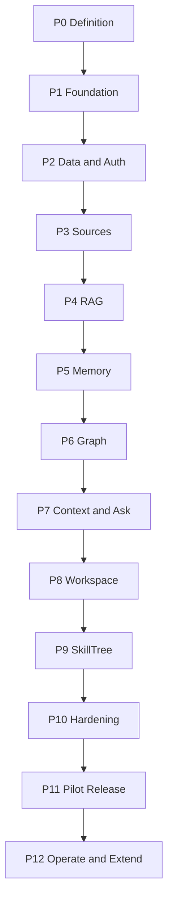

# RekanVault Software Development Life Cycle Plan

> **Execution companion to the RekanVault Product Build Plan**  
> A dependency-gated path from the validated connector prototype to a secure first release of RekanVault.

| Field | Value |
|---|---|
| Document status | Canonical SDLC and Engineering Execution Plan |
| Plan version | 0.1 |
| Created | 31 July 2026 |
| Owner | Ibrahim Muhammad Isa (Imi) |
| Product | RekanVault |
| Repository | `rekan-vault` |
| Product stage | Pre-alpha; connector foundation validated |
| First-release sources | Google Drive and Notion |
| Initial deployment | Modular monolith plus workers on an approximately 8 GB VPS |
| Companion document | `REKANVAULT_PRODUCT_BUILD_PLAN.md` |

---

## 1. Purpose and Authority

The Product Build Plan defines **what RekanVault is and must do**. This SDLC plan defines **how it will be built, verified, released, and operated**.

If the documents conflict:

1. Product scope, product boundaries, domain invariants, and acceptance targets come from the Product Build Plan.
2. Implementation sequence, libraries, dependencies, environment variables, testing, and release gates come from this SDLC plan.
3. A conflict must be resolved in both documents before implementation proceeds.

This is a separate document. Updating it does not silently change product requirements.

### 1.1 Current starting point

The inherited prototype already proves:

- Provider-neutral normalized-document and lifecycle contracts.
- Deterministic document and version identities.
- Google Drive folder scanning, Changes-feed processing, reconciliation, and supported extraction.
- Notion roots, nested blocks, data sources, row pages, signed webhooks, safety polling, and reconciliation.
- Secret-safe configuration and Google OAuth refresh.
- Local atomic pilot state and CLI.
- Twenty-nine passing contract, connector, lifecycle, replay, webhook, and recovery tests.

It does **not** yet prove:

- The consolidated `rekan-vault` repository and package.
- Live PostgreSQL persistence and migrations.
- Production authentication and authorization.
- A durable worker queue and scheduler.
- Qdrant indexing and hybrid retrieval.
- Memory formation, temporal graph, context packs, grounded chat, UI, or SkillTree.
- Production deployment, monitoring, backup, restore, or pilot acceptance.

The SDLC therefore migrates proven behavior before adding new behavior.

---

## 2. Delivery Model

### 2.1 Lifecycle



### 2.2 Phase rules

Each phase must produce:

- A deployable or runnable increment.
- Versioned contracts and migrations where applicable.
- Automated tests at the lowest useful level.
- An end-to-end proof through the thinnest available UI or operator interface.
- Updated operator and developer documentation.
- Measured evidence that the exit gate passed.
- A recorded decision for every blocking open question.

No phase is considered complete because code exists. It is complete only when its exit gate passes.

### 2.3 Phase and release map

| Phase | Primary outcome | Relative effort | Product milestone |
|---|---|---:|---|
| P0 | Approved baseline and decisions | S | Integrated Foundation |
| P1 | One reproducible repository | M | Integrated Foundation |
| P2 | Durable data/auth/job foundation | L | Integrated Foundation |
| P3 | Production Drive and Notion lifecycle | L | Integrated Foundation |
| P4 | Hybrid RAG, evidence, Search | XL | Evidence MVP |
| P5 | Typed memory and review | XL | Memory and Context MVP |
| P6 | Entity and temporal graph | XL | Memory and Context MVP |
| P7 | Context packs and grounded Ask | L | Memory and Context MVP |
| P8 | Integrated human workspace | XL | Human Workspace |
| P9 | Evidence-backed SkillTree | L | SkillTree |
| P10 | Security, operations, and recovery | L | Release Hardening |
| P11 | Pilot and first release | M | `0.1.0` |
| P12 | Operations and extensions | Ongoing | Post-release |

Relative effort is for sequencing and staffing, not a calendar commitment. Calendar estimates require the number of active engineers/agents, reviewer capacity, and pilot-data availability.

### 2.4 Branch and release policy

- Default branch: `main`, protected.
- Work branches: `feat/<scope>`, `fix/<scope>`, `chore/<scope>`.
- Merge method: squash merge.
- Every pull request must link a phase task and acceptance condition.
- Releases use Semantic Versioning.
- Pre-release progression: `0.1.0-alpha.N` → `0.1.0-beta.N` → `0.1.0-rc.N` → `0.1.0`.
- Database migrations are forward-only in production. Rollback uses a compensating migration or database restore, not an unreviewed destructive downgrade.
- Contract-breaking changes require a new major contract version even before product version `1.0`.

### 2.5 Definition of Ready

A task is ready only when:

- Requirement and expected user or system behavior are explicit.
- Dependencies and affected contracts are identified.
- Permission and lifecycle effects are identified.
- Test case or observable acceptance condition exists.
- Required user decision is resolved or an approved default is recorded.

### 2.6 Definition of Done

A task is done only when:

- Code, migration, configuration, and documentation are complete.
- Unit, integration, and relevant end-to-end tests pass.
- Error, retry, idempotency, permission, and audit behavior are covered.
- No secret appears in source, fixtures, logs, or client bundles.
- Static checks and dependency scans pass.
- Operational impact and rollback/recovery path are documented.
- The phase acceptance evidence is retained.

---

## 3. Environment and Dependency Strategy

### 3.1 Supported runtimes

| Runtime | Baseline | Policy |
|---|---|---|
| Linux | Ubuntu 24.04 LTS | Production and CI reference environment |
| Python | 3.12.x | Exact patch selected in `.python-version`; upgrade only after full suite |
| Node.js | 24 LTS | Production web runtime; Node recommends production use of LTS lines |
| pnpm | 11.x | Exact version pinned through Corepack |
| PostgreSQL | Supabase-supported current production major | Extensions and migrations verified in a clean test database |
| Qdrant | Server compatible with locked Python client | Collection schema and snapshot/rebuild tests gate upgrades |
| Docker Engine and Compose | Current stable available on target VPS | Image digests pinned for production |

Node 24 is selected because it is an LTS release as of this plan. The runtime must be revisited at least once per year against the official [Node.js release schedule](https://nodejs.org/en/about/previous-releases).

### 3.2 Dependency locking

- Python project and development dependencies live in `pyproject.toml`.
- `uv.lock` records exact resolved Python packages and is committed.
- JavaScript dependencies live in workspace `package.json` files.
- `pnpm-lock.yaml` is committed.
- Container base images use immutable digests in production manifests.
- Model IDs alone are insufficient: model revision/commit, dimensions, tokenizer, normalization, and license are recorded in `component_versions`.
- Provider API versions are explicit, especially Notion.
- Monthly dependency updates run in a dedicated pull request with the full test suite.

`uv` is selected because a workspace shares one lockfile and produces reproducible project synchronization, as described in the official [uv workspace](https://docs.astral.sh/uv/concepts/projects/workspaces/) and [locking](https://docs.astral.sh/uv/concepts/projects/sync/) documentation.

### 3.3 Configuration hierarchy

Not every setting belongs in an environment variable.

| Configuration class | Storage | Examples |
|---|---|---|
| Secrets | Environment or deployment secret store | API keys, database credentials, encryption keys |
| Deployment topology | Environment | URLs, worker concurrency, storage path, log mode |
| Public browser configuration | `NEXT_PUBLIC_*` only | Supabase URL, publishable key, public API URL |
| Source connection settings | PostgreSQL | Selected roots, source state, reconciliation schedule |
| Product behavior policy | Versioned PostgreSQL record | Review thresholds, memory auto-commit, retention |
| Retrieval policy | Versioned PostgreSQL record | Chunk policy, fusion weights, sufficiency thresholds |
| Model identity | PostgreSQL plus environment default | Provider, model ID, revision, dimensions |
| Code invariant | Source code and schema | Identity derivation, lifecycle state machine |

Secrets must never be stored in source settings, normalized documents, event payloads, Qdrant payloads, audit bodies, or browser-accessible variables.

### 3.4 Core backend library catalog

Exact patch versions are resolved and committed during Phase 1.

| Package/tool | Purpose | Introduced |
|---|---|---|
| `pydantic` | Domain contracts and validated payloads | P1 |
| `pydantic-settings` | Typed environment settings | P1 |
| `jsonschema` | Exported contract validation | P1 |
| `PyYAML` | OpenAPI and schema artifact handling | P1 |
| `FastAPI` | HTTP API and OpenAPI generation | P1 |
| `uvicorn[standard]` | ASGI runtime | P1 |
| `orjson` | Fast deterministic API serialization where compatible | P1 |
| `httpx` | Async provider and model HTTP client | P1 |
| `tenacity` | Explicit bounded retry policies | P1 |
| `structlog` | Structured, redacted logs | P1 |
| `SQLAlchemy` | PostgreSQL data access and transactions | P2 |
| `psycopg[binary]` | PostgreSQL driver used through SQLAlchemy's pool | P2 |
| `alembic` | Versioned database migrations | P2 |
| `PyJWT[crypto]` | Supabase JWT verification | P2 |
| `cryptography` | OAuth-token envelope encryption | P2 |
| `google-api-python-client` | Drive and Docs APIs | P3 |
| `google-auth` | Google credentials and refresh | P3 |
| `google-auth-oauthlib` | Google OAuth authorization flow | P3 |
| `pdfplumber` | Text PDF extraction with page locators | P3 |
| `python-docx` | DOCX extraction | P3 |
| `markdown-it-py` | Markdown structure and headings | P3 |
| `qdrant-client` | Dense-vector index and filtered queries | P4 |
| `sentence-transformers` | Local multilingual embeddings and cross-encoder reranking | P4 |
| `transformers` | Tokenizer/model runtime used by sentence-transformers | P4 |
| CPU build of `torch` | Local model inference | P4 |
| `tiktoken` | Stable token-budget estimation | P4 |
| `openai` | OpenAI-compatible model-provider adapter, including Groq-compatible endpoints | P5 |
| `rapidfuzz` | Entity alias and candidate similarity | P5 |
| `dateparser` | Indonesian/English time-expression candidates | P5 |
| `networkx` | Offline graph fixture validation only, not production storage | P6 |
| `prometheus-client` | Metrics endpoint | P10 |
| OpenTelemetry SDK/exporters | Optional traces and metrics export | P10 |

### 3.5 Core frontend library catalog

| Package/tool | Purpose | Introduced |
|---|---|---|
| `next`, `react`, `react-dom` | Next.js App Router workspace | P1 |
| `typescript` | Typed frontend | P1 |
| `tailwindcss` | Design tokens and layout | P1 |
| `shadcn/ui` generated components | Accessible component foundation without runtime lock-in | P1 |
| `class-variance-authority`, `clsx`, `tailwind-merge` | Component variants and class composition | P1 |
| `lucide-react` | Icons | P1 |
| `zod` | Browser/API payload validation | P1 |
| `@supabase/supabase-js` | Browser authentication client | P2 |
| `@supabase/ssr` | Cookie-based server-side session handling | P2 |
| `@tanstack/react-query` | Server-state cache and mutations | P3 |
| `@tanstack/react-table` | Source, result, review, and audit tables | P3 |
| `react-hook-form`, `@hookform/resolvers` | Forms and Zod validation | P3 |
| `next-intl` | Indonesian/English UI messages | P3 |
| `cytoscape` | Bounded graph visualization | P6 |
| `@tiptap/react` and selected TipTap extensions | Hybrid structured narrative editor if approved | P8 |

Supabase SSR must use cookie-backed sessions and avoid cross-user response caching, following the official [Supabase server-side auth](https://supabase.com/docs/guides/auth/server-side) guidance.

The plan uses Supabase's current publishable/secret key model rather than introducing new legacy `anon`/`service_role` use. Supabase documents the mapping and server-only power of secret keys in its [API-key migration guide](https://supabase.com/docs/guides/getting-started/migrating-to-new-api-keys).

### 3.6 Quality and security tool catalog

| Tool | Purpose |
|---|---|
| `pytest`, `pytest-asyncio`, `pytest-cov` | Backend unit/integration tests and coverage |
| `respx` | Deterministic `httpx` provider mocks |
| `hypothesis` | Lifecycle, identity, cursor, and policy property tests |
| `testcontainers` | Real PostgreSQL/Qdrant integration tests where CI permits Docker |
| `freezegun` | Temporal-state fixtures |
| `schemathesis` | OpenAPI property and negative testing |
| `ruff` | Python formatting and lint |
| `mypy` | Python type checking |
| `bandit`, `pip-audit` | Python security and dependency checks |
| `vitest` | Frontend unit tests |
| Testing Library | React behavior and accessibility-oriented component tests |
| `@playwright/test` | Cross-browser end-to-end tests |
| `axe-core`, `@axe-core/playwright` | Automated accessibility checks |
| ESLint and TypeScript compiler | Frontend static validation |
| Trivy | Container and filesystem vulnerability scan |
| Gitleaks | Secret scanning |
| GitHub Actions | Continuous integration and release automation |

Playwright is selected because it supports Chromium, Firefox, and WebKit with isolated browser contexts, as documented in its [test introduction](https://playwright.dev/docs/intro) and [browser-context guidance](https://playwright.dev/docs/browser-contexts).

---

## 4. Environment Variable Registry

This registry is authoritative for names. Each phase lists only the variables it introduces.

### 4.1 Core runtime

| Variable | Required | Secret | Default/purpose |
|---|---:|---:|---|
| `RV_ENV` | Yes | No | `development`, `test`, `staging`, or `production` |
| `RV_LOG_LEVEL` | No | No | `INFO` |
| `RV_LOG_FORMAT` | No | No | `console` locally; `json` outside local |
| `RV_PUBLIC_BASE_URL` | Yes outside test | No | Canonical web origin |
| `RV_API_BASE_URL` | Yes outside test | No | Canonical API origin |
| `RV_ALLOWED_ORIGINS` | Yes outside test | No | Comma-separated exact browser origins |
| `RV_RELEASE_VERSION` | Yes in deployment | No | Product build identifier |
| `RV_COMPONENT_INSTANCE` | No | No | API/worker instance label; generated if absent |
| `RV_API_HOST` | No | No | `0.0.0.0` inside the API container |
| `RV_API_PORT` | No | No | `8000` |
| `HOSTNAME` | Web container only | No | Next.js bind host; `0.0.0.0` in container |
| `PORT` | Web container only | No | Next.js port; `3000` |
| `RV_REQUEST_MAX_BODY_BYTES` | No | No | Global request safety limit |
| `RV_SHUTDOWN_GRACE_SECONDS` | No | No | `30` |

### 4.2 Database, authentication, and encryption

| Variable | Required | Secret | Default/purpose |
|---|---:|---:|---|
| `RV_DATABASE_URL` | Yes from P2 | Yes | Direct PostgreSQL URL for API and worker |
| `RV_DATABASE_POOL_MIN_SIZE` | No | No | `1` |
| `RV_DATABASE_POOL_MAX_SIZE` | No | No | API `10`; worker tuned separately |
| `RV_DATABASE_STATEMENT_TIMEOUT_MS` | No | No | `30000` |
| `RV_SUPABASE_URL` | Yes from P2 | No | Supabase project URL |
| `RV_SUPABASE_JWKS_URL` | Yes from P2 | No | JWT verification keys endpoint |
| `RV_SUPABASE_JWT_ISSUER` | Yes from P2 | No | Expected issuer |
| `RV_SUPABASE_JWT_AUDIENCE` | No | No | Expected audience when configured |
| `RV_SUPABASE_SECRET_KEY` | Only for approved server admin use | Yes | New Supabase server key; bypasses RLS and is never exposed to the browser |
| `RV_CREDENTIAL_ENCRYPTION_KEYS` | Yes from P2 | Yes | Ordered `key_id:base64key` values for rotation |
| `RV_ACTIVE_CREDENTIAL_KEY_ID` | Yes from P2 | No | Key used for new encryption |
| `NEXT_PUBLIC_SUPABASE_URL` | Yes from P2 | No | Browser-safe project URL |
| `NEXT_PUBLIC_SUPABASE_PUBLISHABLE_KEY` | Yes from P2 | No | Browser-safe publishable key |
| `NEXT_PUBLIC_REKANVAULT_API_URL` | Yes from P2 | No | Browser API origin |

### 4.3 Worker and artifacts

| Variable | Required | Secret | Default/purpose |
|---|---:|---:|---|
| `RV_WORKER_QUEUES` | No | No | Queue names assigned to the worker |
| `RV_WORKER_CONCURRENCY` | No | No | `2`; embedding workers default to `1` |
| `RV_JOB_POLL_INTERVAL_MS` | No | No | `1000` |
| `RV_JOB_LEASE_SECONDS` | No | No | `300` |
| `RV_JOB_MAX_ATTEMPTS` | No | No | `8` |
| `RV_ARTIFACT_STORAGE_BACKEND` | No | No | `filesystem` first release |
| `RV_ARTIFACT_STORAGE_PATH` | Required for filesystem | No | Absolute persistent directory |
| `RV_MAX_SOURCE_FILE_BYTES` | No | No | Initial safety cap; decision required in P3 |

### 4.4 Google Drive and Docs

| Variable | Required | Secret | Default/purpose |
|---|---:|---:|---|
| `RV_GOOGLE_CLIENT_ID` | Yes for OAuth | No | Google OAuth client ID |
| `RV_GOOGLE_CLIENT_SECRET` | Yes for OAuth | Yes | Google OAuth client secret |
| `RV_GOOGLE_OAUTH_REDIRECT_URI` | Yes for OAuth | No | Exact callback URI |
| `RV_GOOGLE_OAUTH_SCOPES` | Yes for OAuth | No | Approved scopes |
| `RV_GOOGLE_PILOT_REFRESH_TOKEN` | Pilot import only | Yes | One-time migration path; remove after encrypted storage |
| `RV_GOOGLE_API_TIMEOUT_SECONDS` | No | No | `30` |

### 4.5 Notion

| Variable | Required | Secret | Default/purpose |
|---|---:|---:|---|
| `RV_NOTION_API_VERSION` | Yes | No | Explicit supported version; first-release target `2026-03-11` |
| `RV_NOTION_TOKEN` | Pilot internal integration only | Yes | Replaced by encrypted per-connection credential later |
| `RV_NOTION_CLIENT_ID` | Public OAuth only | No | Deferred unless approved |
| `RV_NOTION_CLIENT_SECRET` | Public OAuth only | Yes | Deferred unless approved |
| `RV_NOTION_OAUTH_REDIRECT_URI` | Public OAuth only | No | Exact callback URI |
| `RV_NOTION_WEBHOOK_VERIFICATION_TOKEN` | Yes for webhook | Yes | Used to verify signatures |
| `RV_NOTION_API_TIMEOUT_SECONDS` | No | No | `30` |

### 4.6 Retrieval and models

| Variable | Required | Secret | Default/purpose |
|---|---:|---:|---|
| `RV_QDRANT_URL` | Yes from P4 | No | Qdrant endpoint |
| `RV_QDRANT_API_KEY` | Depends on deployment | Yes | Cloud or protected self-hosted key |
| `RV_QDRANT_COLLECTION` | No | No | `rekanvault_chunks_v1` |
| `RV_QDRANT_TIMEOUT_SECONDS` | No | No | `30` |
| `RV_EMBEDDING_PROVIDER` | Yes from P4 | No | `local_sentence_transformers` initially |
| `RV_EMBEDDING_MODEL` | Yes from P4 | No | Candidate default `BAAI/bge-m3` |
| `RV_EMBEDDING_MODEL_REVISION` | Yes in production | No | Immutable model revision |
| `RV_EMBEDDING_DIMENSIONS` | Yes from P4 | No | Must match collection schema |
| `RV_EMBEDDING_DEVICE` | No | No | `cpu` |
| `RV_EMBEDDING_BATCH_SIZE` | No | No | `4` or profiled value |
| `RV_MODEL_CACHE_PATH` | Yes for local models | No | Persistent model-cache directory |
| `HF_HOME` | Yes for Hugging Face runtime | No | Same persistent cache boundary |
| `RV_MODEL_CPU_THREADS` | No | No | Profiled against target VPS |
| `RV_RERANK_PROVIDER` | Yes from P4 | No | `local_cross_encoder` initially |
| `RV_RERANK_MODEL` | Yes from P4 | No | Candidate default `BAAI/bge-reranker-v2-m3` |
| `RV_RERANK_MODEL_REVISION` | Yes in production | No | Immutable model revision |
| `RV_RERANK_TOP_N` | No | No | `20`; policy moves to DB after calibration |
| `RV_LLM_PROVIDER` | Yes from P5 | No | `openai_compatible` |
| `RV_LLM_BASE_URL` | Yes from P5 | No | Provider endpoint; Groq-compatible pilot is supported |
| `RV_LLM_API_KEY` | Yes for hosted inference | Yes | Provider API key |
| `RV_EXTRACTION_MODEL` | Yes from P5 | No | Model ID approved by evaluation |
| `RV_ANSWER_MODEL` | Yes from P7 | No | Model ID approved by evaluation |
| `RV_LLM_TIMEOUT_SECONDS` | No | No | `60` |
| `RV_LLM_MAX_RETRIES` | No | No | `3`; only retry safe failures |
| `RV_MODEL_MAX_CONCURRENCY` | No | No | `2` or provider-limit value |

Groq can be used through the OpenAI-compatible adapter by setting the provider base URL, per the official [Groq compatibility guide](https://console.groq.com/docs/openai). Active model IDs must be resolved at deployment time rather than frozen in this document.

### 4.7 Observability, backup, and deployment

| Variable | Required | Secret | Default/purpose |
|---|---:|---:|---|
| `RV_METRICS_ENABLED` | No | No | `true` outside local |
| `RV_METRICS_AUTH_TOKEN` | Recommended | Yes | Protects non-public metrics |
| `OTEL_SERVICE_NAME` | Optional | No | `rekanvault-api` or `rekanvault-worker` |
| `OTEL_EXPORTER_OTLP_ENDPOINT` | Optional | No | External collector endpoint |
| `OTEL_EXPORTER_OTLP_HEADERS` | Optional | Yes | Collector authentication |
| `SENTRY_DSN` | Optional | Yes | Error monitoring if approved |
| `RV_BACKUP_PATH` | Yes in production | No | Persistent staging path |
| `RV_BACKUP_RETENTION_DAYS` | No | No | Decision in P10 |
| `RV_BACKUP_ENCRYPTION_PASSWORD` | Yes for off-host backups | Yes | Backup encryption secret |
| `RV_BACKUP_REMOTE` | Yes for off-host backups | No | Approved `rclone`/restic destination name |
| `RV_HEALTHCHECK_TOKEN` | Recommended | Yes | Protects deep diagnostic endpoints |
| `RV_DEPLOYMENT_DOMAIN` | Yes in production | No | Public application hostname |
| `RV_ACME_EMAIL` | Yes for automated TLS | No | Certificate-expiry contact |

---

## 5. Phase 0 — Product Baseline and Engineering Decisions

### Objective

Turn the Product Build Plan into an approved, testable first-release baseline before repository restructuring.

### Prerequisites

- Canonical Product Build Plan exists.
- Existing connector prototype and 29-test suite are available.
- Product decision that RekanVault is one modular product is locked.

### Requirements

- Freeze first-release scope and explicit deferrals.
- Convert each product acceptance criterion into one or more evaluation cases.
- Establish domain vocabulary, identifiers, lifecycle states, roles, and permission boundaries.
- Identify personal, confidential, restricted, and public data classes.
- Select the pilot corpus and sandbox provider accounts.
- Record architecture decisions as ADRs.

### Tools and artifacts

| Tool/artifact | Use |
|---|---|
| Markdown ADRs | Durable technical decisions |
| Mermaid | Architecture and lifecycle diagrams |
| JSON Schema/OpenAPI drafts | Contract review |
| GitHub issues/project board | Phase backlog and dependencies |
| Threat-model worksheet | Assets, actors, trust boundaries, misuse cases |
| Evaluation-case template | Expected evidence, memory, graph, permission, and answer behavior |

No production environment variables are introduced.

### Environment variables introduced

None. Phase 0 produces decisions and testable requirements, not runtime configuration.

### To-dos

- [x] Create ADR index and ADR template.
- [x] Record modular-monolith, PostgreSQL, Qdrant, Supabase Auth, provider-adapter, and rebuildability decisions.
- [x] Define first-release persona and exact pilot workflows.
- [x] Define data classification and redaction policy.
- [x] Create initial risk register.
- [x] Map Product Build Plan requirements to phases and test IDs.
- [x] Define golden-set ownership and change-review process.
- [x] Define release evidence folder and naming.
- [x] Freeze explicit non-goals for version `0.1.0`.

### Verification

- Every first-release requirement has an owner phase and test/evidence type.
- No feature exists only as an unassigned aspiration.
- Every blocking unknown is either decided or has a time-bounded default.

### Exit gate

`P0-GATE`: signed first-release baseline, ADR index, risk register, evaluation template, and phase backlog.

## 6. Phase 1 — Repository Consolidation, Contracts, and Developer Experience

### Objective

Create one installable, testable `rekan-vault` repository while preserving all validated connector behavior.

### Dependencies

- `P0-GATE`.
- Existing connector source and fixtures.

### Requirements

- One repository, product package, CLI, API skeleton, worker skeleton, and web workspace.
- No product-visible legacy naming.
- One canonical ID, error, event, permission, evidence, memory, graph, context, skill, and audit schema family.
- Reproducible Python and JavaScript installations.
- CI blocks contract, lint, type, unit-test, secret, and dependency failures.

### Tools and libraries

Backend: `uv`, `pydantic`, `pydantic-settings`, `jsonschema`, `PyYAML`, `FastAPI`, `uvicorn`, `orjson`, `httpx`, `tenacity`, and `structlog`.

Frontend: Node 24 LTS, Corepack, pnpm workspace, Next.js App Router, React, TypeScript, Tailwind, generated shadcn/ui components, Zod, and Lucide.

Quality: `pytest`, `pytest-asyncio`, `pytest-cov`, `respx`, `hypothesis`, `ruff`, `mypy`, `bandit`, `pip-audit`, ESLint, Vitest, Gitleaks, and GitHub Actions.

### Environment variables introduced

- `RV_ENV`
- `RV_LOG_LEVEL`
- `RV_LOG_FORMAT`
- `RV_PUBLIC_BASE_URL`
- `RV_API_BASE_URL`
- `RV_ALLOWED_ORIGINS`
- `RV_RELEASE_VERSION`
- `RV_COMPONENT_INSTANCE`
- `RV_API_HOST`
- `RV_API_PORT`
- `HOSTNAME`
- `PORT`
- `RV_REQUEST_MAX_BODY_BYTES`
- `RV_SHUTDOWN_GRACE_SECONDS`

### To-dos

- [x] Create repository tree from the Product Build Plan.
- [x] Migrate connector code and tests without behavior changes.
- [x] Rename Python package, CLI, headers, docs, fixtures, and generated schemas.
- [x] Remove cross-product compatibility modules and replace them with internal projection tests.
- [x] Create `uv.lock`, `.python-version`, `pnpm-workspace.yaml`, and `pnpm-lock.yaml`.
- [x] Create FastAPI health endpoint and version endpoint.
- [x] Create worker process entrypoint and graceful shutdown contract.
- [x] Create Next.js shell with authentication placeholder and design tokens.
- [x] Generate OpenAPI 3.1 and JSON Schemas from canonical contracts.
- [x] Add typed error envelope and request/correlation IDs.
- [x] Add structured-log redaction tests.
- [x] Configure pre-commit-equivalent checks as repeatable scripts.
- [x] Configure CI matrices for backend, frontend, schemas, and security.
- [x] Preserve and pass all 29 inherited tests.

### Test plan

- Contract serialization round trips.
- Schema examples and negative payloads.
- CLI installed-wheel smoke test outside repository.
- API start/stop and health tests.
- Worker graceful termination test.
- Frontend build and basic render test.
- Secret-pattern test against fixtures and generated output.

### Deliverables

- Installable `rekanvault` Python package.
- Runnable API, worker, CLI, and web shell.
- Locked dependencies.
- Versioned OpenAPI and JSON Schema artifacts.
- Green CI baseline.

### Exit gate

`P1-GATE`: clean checkout installs reproducibly, builds all applications, exports valid contracts, and passes inherited plus new foundation tests.

###   Open Decisions (Delete section if decision already recorded as ADR) (Delete section if decision already recorded as  ADR)  

| Decision | Recommended default | Needed by | Effect |
|---|---|---|---|
| Repository visibility | Private until P11 release candidate | P1 creation | Secret/privacy and licensing exposure |
| Monorepo orchestration | Use plain `uv` + pnpm scripts; do not add Turborepo yet | P1 | Complexity and build caching |
| UI visual direction | Quiet intelligence workspace: dense but calm, desktop-first and responsive | P1 shell | Component tokens and information density |
| Legacy artifact retention | Preserve original release ZIP; do not preserve legacy runtime namespace | P1 migration | Clean architecture vs migration trace |

---

## 7. Phase 2 — PostgreSQL, Identity, Authorization, Jobs, and Audit Foundation

### Objective

Replace local pilot state with transactional PostgreSQL and establish the authorization and durable-work foundations every later phase depends on.

### Dependencies

- `P1-GATE`.
- Supabase project or approved PostgreSQL/Auth equivalent.

### Requirements

- PostgreSQL is authoritative for identity, source state, normalized records, memory, graph, policy, job, and audit data.
- Workspace isolation is enforced in repositories and PostgreSQL RLS.
- Supabase JWTs are verified by issuer, key, expiry, and audience where configured.
- OAuth/provider credentials are encrypted before database storage.
- Job leases, retries, dead-letter state, idempotency, and recovery are durable.
- Outbox events commit in the same transaction as domain state.

### Tools and libraries

- `SQLAlchemy` 2.x async API.
- `psycopg` 3 through SQLAlchemy's async connection pool.
- `alembic`.
- `PyJWT[crypto]`.
- `cryptography` AES-GCM envelope encryption.
- PostgreSQL extensions: `pgcrypto`, `citext`, `pg_trgm`, and `unaccent` if available.
- Supabase Auth and RLS.
- PostgreSQL `FOR UPDATE SKIP LOCKED` and advisory locks for the initial job runtime; no Redis dependency.
- Testcontainers PostgreSQL for integration tests.

### Environment variables introduced

- All variables in sections 4.2 and 4.3.
- `NEXT_PUBLIC_SUPABASE_URL`
- `NEXT_PUBLIC_SUPABASE_PUBLISHABLE_KEY`
- `NEXT_PUBLIC_REKANVAULT_API_URL`

### Schema work

- [ ] `workspaces`, `actors`, `memberships`, `roles`, `grants`.
- [ ] `sources`, `source_roots`, `corpora`.
- [ ] `documents`, `document_versions`, `content_blocks`, `attachments`, `extraction_runs`.
- [ ] `source_events`, `provider_cursors`, `sync_jobs`.
- [ ] `processing_jobs`, `job_attempts`, `outbox_events`, `dead_letters`.
- [ ] Skeleton domain tables for derivatives, objects, memories, entities, relations, reviews, context, skills, and audit.
- [ ] `schema_registry`, `component_versions`, `policy_versions`.
- [ ] Immutable timestamps, fingerprints, idempotency keys, and status histories.

### To-dos

- [ ] Convert draft SQL into Alembic migrations with named constraints.
- [ ] Create clean install, upgrade, and schema-drift checks.
- [ ] Implement repository interfaces and transaction boundary.
- [ ] Implement workspace-scoped query helpers.
- [ ] Add RLS policies and negative isolation tests.
- [ ] Implement JWT middleware and actor resolution.
- [ ] Implement encrypted credential repository with key ID and rotation.
- [ ] Implement durable job claim, heartbeat, retry, timeout, cancellation, and dead-letter.
- [ ] Implement transactional outbox and idempotent consumer.
- [ ] Implement audit writer that cannot include protected content bodies.
- [ ] Add seed command for local/test workspace and roles.
- [ ] Add source-neutral API repository smoke endpoints.

### Test plan

- Clean migration and upgrade from previous revision.
- Concurrent active-version creation cannot violate uniqueness.
- Duplicate idempotency key returns the original result.
- Worker crash releases an expired lease safely.
- Outbox event is never committed without state and vice versa.
- Viewer cannot cross workspace/corpus boundaries.
- Invalid/expired/wrong-issuer JWT is rejected.
- Credential ciphertext decrypts only with approved active/previous key.
- Audit records exist for every seeded high-impact mutation.

### Exit gate

`P2-GATE`: all authoritative state survives restart; RLS and API authorization negative tests pass; durable jobs resume after forced worker termination.

###  Open Decisions (Delete section if decision already recorded as ADR)  

| Decision | Recommended default | Needed by | Effect |
|---|---|---|---|
| Database environment | Separate Supabase project/schema for RekanVault pilot | P2 migration | Isolation from unrelated applications |
| First login method | Email magic link plus administrator-created memberships | P2 UI auth | User onboarding and support |
| Service-role use | Restrict to migrations/admin jobs; normal API uses user JWT plus scoped DB role | P2 repositories | Blast radius |
| Credential key custody | One active and one previous key stored only in deployment secrets | P2 credential migration | Rotation and recovery |
| Job implementation | Custom PostgreSQL lease table first; revisit dedicated queue only after metrics | P2 | Operational dependencies |

---

## 8. Phase 3 — Production Google Drive and Notion Lifecycle

### Objective

Move proven connector behavior onto durable state and make real Drive/Notion scopes observable and recoverable.

### Dependencies

- `P2-GATE`.
- Google Cloud project with Drive and Docs APIs.
- Notion integration and webhook subscription.
- Public HTTPS callback/webhook URL for non-local validation.

### Requirements

- Initial scans, incremental signals, scheduled reconciliation, and manual repair converge to the same state.
- Rename and move preserve document identity.
- Content-relevant change creates one immutable version.
- Trash, archive, deletion, move out of scope, and access loss immediately deactivate retrieval eligibility.
- Provider cursor advances only after durable processing.
- Provider rate limits and transient failures use bounded exponential backoff with jitter.
- Source health, job history, freshness, and extraction warnings are visible through API and thin operator UI.

### Tools and libraries

- `google-api-python-client`, `google-auth`, `google-auth-oauthlib`.
- Drive API v3 Changes feed.
- Google Docs API `documents.get` for structured content and locators.
- `httpx` for Notion API with explicit `2026-03-11` version header.
- `pdfplumber`, `python-docx`, `markdown-it-py`.
- `tenacity` retry policies.
- React Query/Table and React Hook Form for Sources UI.

Google Drive change entries are ordered and the new start-page token is stored only after all pages are handled, following the official [Drive Changes guide](https://developers.google.com/workspace/drive/api/guides/manage-changes). Google Docs structure should use [`documents.get`](https://developers.google.com/workspace/docs/api/reference/rest/v1/documents/get), not only plain-text export.

Notion webhooks are change signals rather than canonical content. Events can be delayed, aggregated, or out of order, so the connector must refetch and reconcile as specified in the official [Notion event-delivery guide](https://developers.notion.com/reference/webhooks-events-delivery). Nested content requires recursive paginated block traversal via [Retrieve block children](https://developers.notion.com/reference/get-block-children).

The inherited adapter targets `2025-09-03`. Phase 3 must migrate it to Notion's current `2026-03-11` API, whose official [upgrade guide](https://developers.notion.com/guides/get-started/upgrade-guide-2026-03-11) identifies breaking changes in block operations, trash/archive semantics, and transcription blocks. Webhook handlers must accept both shapes during the controlled migration window.

### Environment variables introduced

- All Google variables in section 4.4.
- All Notion variables in section 4.5.
- `RV_MAX_SOURCE_FILE_BYTES`
- Artifact-storage variables in section 4.3.

### To-dos

#### Google Drive

- [ ] Implement authorization callback and encrypted refresh-token storage.
- [ ] Register selected roots and validate access.
- [ ] Capture start-page token before the first scan.
- [ ] Scan recursively with Shared Drive flags where applicable.
- [ ] Use Drive metadata plus Docs structure for Google Docs.
- [ ] Download supported blob formats as streams.
- [ ] Persist permissions/fingerprint at the implemented scope.
- [ ] Process ordered changes and save cursor atomically.
- [ ] Reconcile selected scope authoritatively.
- [ ] Handle move in/out, rename, trash, restore, removal, and access revocation.

#### Notion

- [ ] Store integration token encrypted; environment token is import-only.
- [ ] Add `2026-03-11` API fixtures and migrate block, `in_trash`, and transcription handling.
- [ ] Traverse root pages, child pages, nested blocks, databases, data sources, schemas, and rows.
- [ ] Preserve Notion block IDs as citation locators.
- [ ] Verify raw-body webhook signature before parsing.
- [ ] Deduplicate provider event ID and enqueue refetch.
- [ ] Implement last-edited-time safety poll.
- [ ] Reconcile configured roots and inaccessible objects.
- [ ] Handle archive/delete, restore, move, and permission loss.
- [ ] Preserve attachment references without recursively downloading them.
- [ ] Run a dual-version webhook compatibility window before changing the subscription version.

#### Shared lifecycle

- [ ] Port existing provider-neutral mutation contract.
- [ ] Persist normalized blocks and extraction quality.
- [ ] Add file-size, MIME, decompression, and request limits.
- [ ] Add source health and diagnostic APIs.
- [ ] Build Sources UI: connection, roots, status, freshness, errors, re-run.
- [ ] Add manual reprocess/reconcile action with audited confirmation.
- [ ] Test real sandbox accounts, not only mocks.

### Test plan

- Contract fixtures plus provider HTTP recordings with secrets removed.
- Sandbox create, edit, rename, move, move out, restore, delete, and revoke.
- Duplicate/delayed/out-of-order event property tests.
- Crash before and after cursor commit.
- Provider 401/403/404/409/429/5xx behavior.
- Large/unsupported/corrupt file behavior.
- Missed Notion webhook repaired by poll/reconciliation.
- API/UI source health agrees with database state.

### Exit gate

`P3-GATE`: pilot Drive and Notion scopes converge after full lifecycle tests, duplicate delivery, missed signals, provider throttling, and forced worker downtime.

###  Open Decisions (Delete section if decision already recorded as ADR)  

| Decision | Recommended default | Needed by | Effect |
|---|---|---|---|
| Google scope | Internal pilot: `drive.readonly`; public product later evaluates `drive.file` + Picker | OAuth setup | Access breadth and Google verification |
| Notion connection | Internal integration token for pilot; public OAuth deferred | P3 | Onboarding and token model |
| Reconciliation cadence | Incremental Drive 3 min; Notion safety poll 5 min; both reconcile daily | P3 scheduler | Freshness, quota, VPS load |
| Maximum source file | 50 MiB first release, configurable lower by workspace | P3 | Memory, download, abuse limits |
| Google Docs tabs | Ingest all tabs and preserve tab locator | P3 structured extraction | Citation completeness |
| Attachments | Preserve Notion links only in first release | P3 | Scope and storage |

---

## 9. Phase 4 — Evidence Layer, Hybrid RAG, and Search

### Objective

Make current authorized evidence searchable and citable through deterministic hybrid retrieval.

### Dependencies

- `P3-GATE`.
- Qdrant instance or cloud project.
- Approved multilingual embedding and reranking models.
- Initial golden corpus and question/evidence set.

### Requirements

- Deterministic structure-aware chunk IDs.
- PostgreSQL full-text lexical candidates.
- Qdrant dense candidates with permission and active-version payload filters.
- Parallel retrieval, reciprocal-rank fusion, cross-encoder reranking, overlap deduplication, and sufficiency scoring.
- Exact source, version, and locator on every evidence result.
- Stale or unauthorized version cannot be returned.
- Qdrant is fully rebuildable from PostgreSQL and normalized artifacts.

### Tools and libraries

- PostgreSQL `tsvector`, `websearch_to_tsquery`, `unaccent`, and `pg_trgm`.
- `qdrant-client` and Qdrant payload indexes.
- `sentence-transformers`, `transformers`, CPU `torch`.
- Candidate embedding model: `BAAI/bge-m3`, whose model card states multilingual support for more than 100 languages: [BGE-M3 model card](https://huggingface.co/BAAI/bge-m3).
- Candidate reranker: `BAAI/bge-reranker-v2-m3`, a multilingual cross-encoder: [reranker model card](https://huggingface.co/BAAI/bge-reranker-v2-m3).
- `tiktoken` for stable chunk/context budget estimates.
- Custom RRF and deduplication code; do not add a RAG framework.

Qdrant payload filters enforce workspace, corpus, state, version, origin, and permission constraints; its official documentation describes [filtering](https://qdrant.tech/documentation/search/filtering/) and [hybrid fusion](https://qdrant.tech/documentation/search/hybrid-queries/). RRF is the safe default until a labeled evaluation set justifies tuned weights.

### Environment variables introduced

- All Qdrant, embedding, and reranking variables in section 4.6.
- No relevance threshold is permanently controlled only by environment; calibrated policies move to versioned database records.

### To-dos

- [ ] Define versioned chunk policy by block type and locator.
- [ ] Generate stable chunks and PostgreSQL lexical vectors.
- [ ] Create Qdrant collection with named vector and indexed payload fields.
- [ ] Implement derivative outbox consumer and version-aware upsert/deactivate.
- [ ] Implement query normalization, filters, lexical and dense retrieval.
- [ ] Implement RRF, reranking, overlap deduplication, and final scoring.
- [ ] Implement evidence packet and typed insufficient-evidence result.
- [ ] Implement citation resolver for Drive and Notion.
- [ ] Add Search API with filters and redacted diagnostics.
- [ ] Add Search UI and evidence inspector.
- [ ] Build evaluation runner: Recall@10, MRR, nDCG, citation resolution, latency.
- [ ] Add Qdrant delete-and-rebuild command and comparison report.
- [ ] Profile embedding and reranking on the target VPS.

### Test plan

- Stable chunk IDs across identical reprocessing.
- Active-version switch is atomic from a requester's perspective.
- Permission, corpus, source, type, time, and state filters.
- Stale/revoked evidence negative tests.
- Exact phrase, Indonesian semantic, English semantic, mixed-language, acronym, and entity queries.
- Known-unanswerable questions.
- Qdrant deletion and deterministic rebuild.
- Resource profile at realistic corpus size.

### Exit gate

`P4-GATE`: live source changes become searchable with correct citations; stale/revoked content disappears; initial golden set reaches Product Build Plan retrieval and citation targets.

###  Open Decisions (Delete section if decision already recorded as ADR)  

| Decision | Recommended default | Needed by | Effect |
|---|---|---|---|
| Qdrant deployment | Existing Qdrant Cloud for pilot; retain self-hosted Compose profile | P4 | VPS RAM and operational load |
| Embedding model | Evaluate BGE-M3 against one smaller multilingual candidate; choose by Recall@10 and RAM/latency | P4 indexing | Quality and 8 GB fit |
| Reranker | BGE reranker on top 20 with worker concurrency 1 | P4 query pipeline | Latency and quality |
| Golden set size | Minimum 100 questions: exact, semantic, temporal, negative, and permission cases | P4 gate | Confidence in metrics |
| Chunk policy | Structure-first; target about 450 tokens, limited 80-token overlap only across continuous prose | P4 | Retrieval/citation granularity |

---

## 10. Phase 5 — Typed Memory Formation and Review

### Objective

Transform evidence and direct contributions into typed, reviewable, evidence-linked memory without allowing generated summaries to become silent truth.

### Dependencies

- `P4-GATE`.
- Approved extraction model/provider.
- Versioned memory schemas and review policy.

### Requirements

- Core memory schemas and direct-write templates.
- Source-backed extraction returns candidates with exact evidence anchors.
- Every automated output records model, prompt, schema, and pipeline versions.
- High-impact or uncertain candidate cannot auto-commit.
- Source update, deletion, or access loss re-evaluates memory support.
- Replay is idempotent.

### Tools and libraries

- `openai` SDK behind a RekanVault provider interface; Groq-compatible base URL is the pilot default.
- Pydantic JSON Schemas for structured model output validation.
- `rapidfuzz` for alias candidates.
- `dateparser` for time-expression candidates.
- PostgreSQL review queues and source bindings.
- No LangChain/LlamaIndex dependency; orchestration remains explicit and testable.

### Environment variables introduced

- `RV_LLM_PROVIDER`
- `RV_LLM_BASE_URL`
- `RV_LLM_API_KEY`
- `RV_EXTRACTION_MODEL`
- `RV_LLM_TIMEOUT_SECONDS`
- `RV_LLM_MAX_RETRIES`
- `RV_MODEL_MAX_CONCURRENCY`

Prompt versions, temperature, schema, confidence, and review rules are versioned database policy, not anonymous environment changes.

### To-dos

- [ ] Implement schemas for Fact, Claim, Decision, Policy, Procedure, Event, Project, Task, Idea, Risk, Assumption, Lesson, Metric, Person, Organization, Topic, Asset, and Skill.
- [ ] Implement direct-write API and initial templates.
- [ ] Create extraction prompt registry with immutable versions.
- [ ] Validate structured outputs and reject unknown fields.
- [ ] Attach evidence at claim/field granularity where practical.
- [ ] Implement confidence, ambiguity, impact, and contradiction signals.
- [ ] Implement auto-commit allowlist and mandatory-review rules.
- [ ] Build Review API/UI for approve, correct, dispute, reject, and defer.
- [ ] Implement source diff to affected binding detection.
- [ ] Implement unsupported, inaccessible, superseded, and invalidated states.
- [ ] Add prompt-injection boundary: source text is data, never instructions.
- [ ] Record token use, latency, provider/model, and redacted failure diagnostics.
- [ ] Build labeled extraction evaluation set.

### Test plan

- Golden documents for each enabled memory type.
- Hallucinated field and citation rejection.
- Prompt injection inside source content.
- Duplicate extraction replay.
- Source edit changes only affected memories.
- Source deletion with single vs multiple remaining evidence anchors.
- High-impact decision always enters review.
- Direct write records author and audit.
- Provider timeout, malformed JSON, refusal, and rate limit.

### Exit gate

`P5-GATE`: enabled memory types meet agreed extraction precision; 100% of verified source-derived memories resolve to valid authorized evidence; update/delete/replay behavior is correct.

###  Open Decisions (Delete section if decision already recorded as ADR)  

| Decision | Recommended default | Needed by | Effect |
|---|---|---|---|
| Initial auto-commit | Only deterministic source metadata and low-impact entity mentions; decisions/policies/risks always reviewed | P5 | Trust and review load |
| Initial direct templates | Decision, Idea, Project, Risk, Lesson, Procedure | P5 UI | First practical workflows |
| Extraction model | Select from currently active Groq models using labeled extraction benchmark | P5 | Cost/free limits and quality |
| Historical unsupported memory | Visible to authorized reviewers as unsupported; hidden from current-answer default | P5 | Audit vs confusion |
| High-impact categories | Decision, Policy, Permission, Risk, Entity merge, Skill mastery | P5 | Mandatory review |

---

## 11. Phase 6 — Entity Resolution, Temporal State, and Knowledge Graph

### Objective

Connect memories into explainable, permission-aware, time-sensitive relationships while preserving reversible identity history.

### Dependencies

- `P5-GATE`.
- Approved predicate vocabulary and entity-review rules.

### Requirements

- Canonical entity IDs, aliases, provider IDs, redirects, merge and unmerge.
- Typed, directional, temporal, evidence-linked relations.
- Current-state resolution does not erase history.
- Bounded graph traversal cannot leak unauthorized neighbors.
- PostgreSQL remains graph source of truth in the first release.

### Tools and libraries

- PostgreSQL relation tables, recursive CTEs, range/time indexes, and materialized views.
- `rapidfuzz` plus evidence/context features for candidate matching.
- `networkx` only for offline fixture validation.
- Cytoscape introduced in the thin Graph UI.
- No Neo4j or dedicated graph database in the first release.

### Environment variables introduced

No required runtime secrets. Graph depth, result limits, match thresholds, and auto-merge policy are versioned database policies.

### To-dos

- [ ] Implement canonical entities and aliases.
- [ ] Implement match proposal with explainable feature scores.
- [ ] Implement merge transaction, redirect, history, and unmerge.
- [ ] Implement typed relation lifecycle and evidence anchors.
- [ ] Implement occurred, recorded, effective, observed, superseded, expiry, and review times.
- [ ] Implement current-state resolver and explanation.
- [ ] Implement bounded neighborhood API with permission pruning.
- [ ] Implement decision and project timeline APIs.
- [ ] Add Graph UI with relation/status/time/origin filters.
- [ ] Build merge/relation review flows.
- [ ] Add graph consistency and orphan checks.

### Test plan

- Full name, nickname, role title, and organization acronym fixtures.
- Ambiguous same-name people never auto-merge.
- Merge/unmerge preserves links and audit.
- Superseded/reversed decision resolves current state correctly.
- Historical query returns the correct past state.
- Traversal stops at unauthorized nodes/edges.
- Relation without adequate evidence cannot become verified.
- Bounded queries respect depth and node caps under load.

### Exit gate

`P6-GATE`: entity and temporal golden fixtures pass; graph neighborhoods are explainable, bounded, reversible, and permission-safe.

###  Open Decisions (Delete section if decision already recorded as ADR)  

| Decision | Recommended default | Needed by | Effect |
|---|---|---|---|
| Automatic merge | No automatic person merge in first release; auto-accept only low-risk exact external-ID matches | P6 | False-merge risk |
| First graph views | Local neighborhood, decision timeline, project dependencies | P6 UI | Scope and usability |
| Relation vocabulary | Start with the Product Plan predicate list; new predicates require schema review | P6 | Consistency |
| Default history | Show current state first with visible history badge and timeline | P6 | Cognitive load |

---

## 12. Phase 7 — Context Packs, Grounded Answers, and Ask

### Objective

Assemble the smallest sufficient current context and generate claim-cited answers that explicitly surface uncertainty and insufficient evidence.

### Dependencies

- `P6-GATE`.
- Approved answer model and context policy.
- Retrieval, memory, graph, and temporal APIs stable.

### Requirements

- Immutable context-pack snapshot.
- Evidence and memory retrieval coordinated under one permission/time scope.
- Graph expansion is bounded and explainable.
- Claims map to citations.
- Contradictions, staleness, missing evidence, and inference are explicit.
- Unsupported question returns typed insufficient-evidence state.
- Streaming must not expose an uncited final claim.

### Tools and libraries

- Existing OpenAI-compatible provider adapter.
- `tiktoken` for budget estimation.
- FastAPI streaming response or Server-Sent Events.
- PostgreSQL conversation/context/citation records.
- React Query plus native streamed `fetch` in Ask UI.

### Environment variables introduced

- `RV_ANSWER_MODEL`
- Existing LLM provider variables from P5.

Context budgets, retention, allowed historical/disputed material, and answer thresholds are versioned policies.

### To-dos

- [ ] Implement intent and entity resolution.
- [ ] Implement mixed memory/evidence retrieval.
- [ ] Implement bounded graph expansion and temporal state selection.
- [ ] Rank by relevance, authority, freshness, confidence, and task fit.
- [ ] Compress to context budget without losing evidence mapping.
- [ ] Persist immutable context pack and diagnostics.
- [ ] Implement grounded answer prompt and structured claim-citation output.
- [ ] Validate every material claim against eligible citations.
- [ ] Implement insufficient-evidence, contradiction, and stale-data responses.
- [ ] Add Ask UI with scope, time, source, entity, and history controls.
- [ ] Add feedback for answer, citation, current state, and relevance.
- [ ] Build answer-support and unknown-behavior evaluation.

### Test plan

- Current decision vs historical decision.
- Conflicting Drive/Notion evidence.
- No-evidence and permission-hidden evidence.
- Expired/stale evidence.
- Citation points to the exact active version and locator.
- Context-budget truncation keeps highest-value support.
- Streaming interruption and retry do not duplicate messages.
- Prompt injection and model attempt to cite nonexistent IDs.

### Exit gate

`P7-GATE`: answer-support, current-state, contradiction, permission, and unknown-behavior benchmarks meet Product Plan targets.

###  Open Decisions (Delete section if decision already recorded as ADR)  

| Decision | Recommended default | Needed by | Effect |
|---|---|---|---|
| Answer model | Evaluate active Groq models; choose strongest structured-output model within available limits | P7 | Quality and latency |
| Default answer scope | Combined evidence + verified memory; inferred/disputed content visibly separated | P7 | Trust |
| Chat retention | 90 days by default; context packs retained with audit policy, configurable by admin | P7/P10 | Storage and privacy |
| Indonesian response behavior | Answer in the user's query language; preserve original quotations/citations | P7 | Usability |
| Contradiction behavior | Do not silently choose; show conflict unless temporal authority resolves it | P7 | Decision safety |

---

## 13. Phase 8 — Integrated Human Workspace

### Objective

Consolidate all thin operator surfaces into a coherent workspace where a non-engineer can complete the primary knowledge loop.

### Dependencies

- `P7-GATE`.
- Stable source, search, memory, graph, review, and answer APIs.
- Approved information architecture and editor choice.

### Requirements

- Home, Ask, Search, Vault, Graph, Review, Sources, and Admin.
- Evidence and audit remain reachable from every derived object.
- Keyboard, responsive, accessibility, empty, loading, error, and permission-denied states.
- No browser bundle contains service-role or provider credentials.
- User can complete core workflows without CLI/database access.

### Tools and libraries

- Next.js App Router and TypeScript.
- Tailwind and generated shadcn/ui components.
- React Query, React Table, Zod, React Hook Form.
- `next-intl`.
- Cytoscape.
- TipTap if the hybrid editor decision is approved.
- Vitest, Testing Library, Playwright, and axe.

### Environment variables introduced

No new secrets. Browser code may use only:

- `NEXT_PUBLIC_SUPABASE_URL`
- `NEXT_PUBLIC_SUPABASE_PUBLISHABLE_KEY`
- `NEXT_PUBLIC_REKANVAULT_API_URL`

### To-dos

- [ ] Finalize route and navigation map.
- [ ] Build Home: recent changes, reviews, source health, saved views.
- [ ] Complete Ask and Search.
- [ ] Build Vault list and typed object/entity/project/decision pages.
- [ ] Build evidence inspector and source-version viewer.
- [ ] Build backlinks, mentions, collections, and timeline.
- [ ] Complete bounded Graph interaction.
- [ ] Complete Review queues and compare/approve/correct actions.
- [ ] Complete Sources and Admin operational surfaces.
- [ ] Add direct memory editor and autosaved drafts.
- [ ] Add Indonesian/English message catalog.
- [ ] Add optimistic mutation only where reversal is safe.
- [ ] Add global permission-denied and stale-data handling.
- [ ] Add accessibility and responsive QA.
- [ ] Add analytics limited to product events without protected content.

### Test plan

- Viewer, contributor, reviewer, and administrator journeys.
- Connect → sync → search → cite → memory → review → graph → ask.
- Expired session and permission change mid-session.
- Loading, empty, failure, retry, and offline/reconnect states.
- Keyboard navigation and automated accessibility.
- Chromium, Firefox, and WebKit desktop; responsive mobile smoke.
- Browser cache cannot cross users.

### Exit gate

`P8-GATE`: representative user completes the Product Plan workspace acceptance workflow without engineering assistance.

###  Open Decisions (Delete section if decision already recorded as ADR)  

| Decision | Recommended default | Needed by | Effect |
|---|---|---|---|
| Narrative editor | Hybrid: structured fields plus TipTap narrative saved as portable JSON + Markdown export | P8 | Editing power and portability |
| Mobile priority | Responsive read/review/search; complex graph administration desktop-first | P8 | Scope and QA |
| Home emphasis | Source health, active decisions/reviews, recent change, quick Ask | P8 | Daily usefulness |
| UI density | Visual hierarchy and progressive disclosure; no dashboard overload | P8 | Learning curve |
| Collections | Manual collections first; smart/dynamic collections after pilot | P8 | Complexity |

---

## 14. Phase 9 — Evidence-Backed SkillTree

### Objective

Add skills, prerequisites, evidence, progress, gaps, and paths as a native graph-backed product surface.

### Dependencies

- `P8-GATE`.
- Stable entity, graph, memory, evidence, review, and workspace patterns.
- Approved progression model.

### Requirements

- Skill identity, aliases, definitions, domains, prerequisites, dependents, levels, evidence rules, resources, and subjects.
- Progress is proposed from evidence but high-confidence mastery requires approved evidence/rules.
- Skill permissions follow supporting artifacts.
- Recommendations explain evidence, prerequisites, gaps, and why the next step is suggested.

### Tools and libraries

- Existing PostgreSQL graph and temporal services.
- Existing Cytoscape UI.
- Existing memory extraction/provider adapter for proposals.
- Deterministic rule engine in application code for first release; no opaque recommendation model.

### Environment variables introduced

No new environment variables. Progress rules and recommendation weights are versioned database policy.

### To-dos

- [ ] Implement skill, skill relation, evidence, progress, resource, and goal schemas.
- [ ] Implement prerequisite-cycle validation.
- [ ] Implement evidence proposal from projects, artifacts, assessments, outcomes, and human confirmation.
- [ ] Implement progress review and stale/needs-review state.
- [ ] Implement tree, graph, path, timeline, evidence drawer, and gap views.
- [ ] Implement role/objective gap analysis.
- [ ] Implement explainable next-skill rules.
- [ ] Link skills to people, projects, lessons, decisions, and resources.
- [ ] Add import/export for skill definitions.
- [ ] Build SkillTree golden fixtures.

### Test plan

- Cyclic prerequisite rejection.
- Permission-safe evidence aggregation.
- High-confidence progression without evidence is rejected.
- Evidence revocation changes progress state appropriately.
- Recommendation explanation matches rules.
- Historical progress is preserved.
- One objective returns a valid prerequisite path and gaps.

### Exit gate

`P9-GATE`: skill progress and recommendations are navigable, evidence-backed, reviewable, permission-safe, and historically traceable.

###  Open Decisions (Delete section if decision already recorded as ADR)  

| Decision | Recommended default | Needed by | Effect |
|---|---|---|---|
| Progress model | Hybrid: named stages plus evidence requirements and milestone gates | P9 | Explainability |
| Initial subject scope | Individuals first; team capability aggregation after pilot | P9 | Privacy and complexity |
| Mastery approval | Reviewer approval required for Proficient and Teaching | P9 | Trust |
| Recommendation objective | User-selected goal/role, never one universal path | P9 | Relevance |

---

## 15. Phase 10 — Security, Governance, Observability, Recovery, and Deployment

### Objective

Make the full system safe and recoverable enough for a real pilot on the target infrastructure.

### Dependencies

- `P9-GATE`.
- Production domain/VPS access.
- Approved backup destination and retention policy.

### Requirements

- Least-privilege roles and secrets.
- TLS, secure headers, request limits, and rate limits.
- Complete high-impact audit.
- Structured logs, metrics, health, queue, source, retrieval, model, and resource visibility.
- PostgreSQL restore and Qdrant rebuild demonstrated.
- Deployment and rollback runbooks.
- No mandatory Redis, graph database, or heavyweight observability stack on the 8 GB target.

### Tools and libraries

- Docker multi-stage builds and Docker Compose.
- Caddy for TLS and reverse proxy.
- `prometheus-client`; optional OpenTelemetry exporter.
- `pg_dump`/`pg_restore`.
- Qdrant rebuild from authoritative records; snapshot optional.
- `rclone` or restic-compatible encrypted off-host backup after decision.
- Trivy, Gitleaks, Bandit, pip-audit, pnpm audit.
- Linux system monitoring and container health checks.

Next.js is self-hosted using its documented production output and runtime-variable rules; only non-secret values use `NEXT_PUBLIC_*`. See the official [Next.js self-hosting](https://nextjs.org/docs/app/guides/self-hosting) and [environment-variable](https://nextjs.org/docs/app/guides/environment-variables) guides.

### Environment variables introduced

- All observability, backup, and health variables in section 4.7.
- Deployment-only `POSTGRES_PASSWORD` or local Qdrant keys are used only in self-hosted profiles and are never committed.

### To-dos

- [ ] Complete threat model against implemented system.
- [ ] Review every API for authentication, authorization-before-serialization, object scope, rate, and size limits.
- [ ] Add CSRF/session/cookie and CORS hardening.
- [ ] Add SSR cache-safety review.
- [ ] Add secure headers through Caddy/Next.js.
- [ ] Validate OAuth callback and webhook replay/signature behavior.
- [ ] Validate credential rotation.
- [ ] Add `/health/live`, `/health/ready`, protected deep health, and metrics.
- [ ] Add dashboards or lightweight views for queue depth, failures, sync freshness, retrieval latency, model errors, RAM, and disk.
- [ ] Build production images and Compose profiles.
- [ ] Add zero/low-downtime migration procedure appropriate to one VPS.
- [ ] Automate encrypted PostgreSQL backup and off-host copy.
- [ ] Demonstrate restore into a clean environment.
- [ ] Demonstrate Qdrant loss and rebuild.
- [ ] Run dependency, secret, container, and permission scans.
- [ ] Write operator, incident, credential rotation, restore, and rebuild runbooks.
- [ ] Profile API plus workers within RAM/CPU/disk limits.

### Test plan

- OWASP-oriented API and browser negative tests.
- IDOR/cross-workspace/cross-corpus attempts.
- Malicious file, huge request, webhook replay, invalid signature, and rate burst.
- Token rotation and revoked membership.
- Database outage, Qdrant outage, provider outage, worker crash, and disk pressure.
- Backup corruption detection and clean restore.
- Full Qdrant rebuild benchmark.
- 24-hour soak with scheduled sync/reconciliation.

### Exit gate

`P10-GATE`: security checklist passes; backup/restore and index rebuild are demonstrated; 24-hour soak fits target resources with no unresolved critical/high issue.

###  Open Decisions (Delete section if decision already recorded as ADR)  

| Decision | Recommended default | Needed by | Effect |
|---|---|---|---|
| Production domain | Dedicated subdomain with Caddy-managed TLS | P10 deployment | OAuth/webhooks and access |
| Backup destination | Encrypted off-host copy to a separate account/storage boundary | P10 | Disaster recovery |
| Retention | Daily 14 days, weekly 8 weeks, monthly 12 months; adjust after data-volume test | P10 | Storage and recovery window |
| Error monitoring | Structured logs + metrics first; add hosted Sentry only if free tier/privacy is acceptable | P10 | Operational visibility |
| Exact provider ACL parity | Remains deferred; root/corpus permission boundary first release | P10 sign-off | Security promise and scope |

---

## 16. Phase 11 — Pilot, Release Candidate, and First Release

### Objective

Prove the complete product with representative users and data, resolve critical findings, and publish a controlled first release.

### Dependencies

- `P10-GATE`.
- Named pilot users and success owner.
- Approved privacy notice, operating policy, and go/no-go authority.

### Requirements

- Full acceptance criteria executed against representative corpus.
- Pilot onboarding, support, feedback, incident, and rollback paths.
- Metrics compare against Product Build Plan targets.
- No unresolved critical or high security/data-integrity defect.
- Known limitations are explicit.

### Tools and artifacts

- Staging and production Compose environments.
- Seeded evaluation runner.
- Playwright release suite.
- Release checklist, pilot guide, issue template, feedback survey, and incident log.
- Semantic release tag and signed checksums for downloadable artifacts.

### Environment variables introduced

No new application variables. Staging and production receive separate values, credentials, databases, Qdrant collections, OAuth callbacks, encryption keys, and backup locations.

### To-dos

- [ ] Prepare staging with sanitized representative data.
- [ ] Run migration, connector, retrieval, memory, graph, context, UI, permission, recovery, and resource gates.
- [ ] Train pilot users on source connection, search, Ask, review, corrections, and limitations.
- [ ] Run time-bounded pilot.
- [ ] Collect task completion, relevance, citation, correction, review load, latency, and trust feedback.
- [ ] Fix release-blocking findings and repeat affected gates.
- [ ] Freeze release candidate dependencies and model revisions.
- [ ] Produce release notes, operator guide, user guide, API docs, known limitations, and upgrade path.
- [ ] Decide repository/publication and license before public distribution.
- [ ] Tag and deploy `0.1.0`.
- [ ] Record go/no-go decision and evidence.

### Test plan

- Full Product Build Plan acceptance matrix.
- Clean install and upgrade from the previous release candidate.
- Real Drive and Notion lifecycle against pilot scopes.
- Retrieval, citation, memory, graph, context, answer, SkillTree, permission, audit, and recovery regression.
- Cross-browser primary workflows.
- Release-image vulnerability and secret scans.
- Backup restore and Qdrant rebuild from the frozen release candidate.
- Pilot task completion and observed trust/correction outcomes.

### Release metrics

- Lifecycle convergence: 100% of tested transitions.
- No stale active evidence after successful invalidation.
- Retrieval Recall@10: at least 85% on approved golden set.
- Citation resolution: at least 95%.
- Material answer claims supported: at least 90%.
- Source-derived verified memories with valid evidence: 100%.
- Auto-accepted entity match precision: at least 95% if auto-accept is enabled.
- Permission leakage: zero.
- Backup restore and Qdrant rebuild: demonstrated.
- Target resource fit: demonstrated.

### Exit gate

`P11-GATE`: Imi approves go-live after acceptance evidence, pilot findings, known limitations, recovery proof, and release policy review.

###  Open Decisions (Delete section if decision already recorded as ADR)  

| Decision | Recommended default | Needed by | Effect |
|---|---|---|---|
| Pilot group | 3–5 users covering leader, contributor, reviewer, and administrator roles | P11 | Workflow coverage |
| Pilot duration | Two weeks or enough time for at least two full source-change cycles | P11 | Quality of findings |
| Public release | Controlled private alpha first; public repository only after license/security review | P11 | Exposure and support |
| Go/no-go authority | Imi owns product decision; technical owner can veto for security/data-integrity gate failure | P11 | Release safety |
| Success priority | Trust/correctness before feature breadth or response speed | P11 | Triage order |

---

## 17. Phase 12 — Operate, Measure, and Extend

### Objective

Run RekanVault as a living product, learn from measured use, and add scope without weakening evidence, permissions, or recoverability.

### Dependencies

- `P11-GATE`.

### Requirements

- Production incidents, user feedback, retrieval misses, corrections, and review outcomes become traceable backlog inputs.
- Dependency, provider API, model, prompt, policy, and schema changes remain versioned and reversible.
- Retention, backup, restore, access review, and recovery drills continue after launch.
- A new capability cannot weaken existing provenance, permission, lifecycle, or recovery gates.

### Operating cadence

| Cadence | Activity |
|---|---|
| Daily | Source/queue/backup/health review; critical incident handling |
| Weekly | Retrieval failures, review backlog, stale knowledge, user feedback, resource use |
| Monthly | Dependency/model update PR, restore sample, golden-set additions, policy review |
| Quarterly | Full recovery drill, access review, data retention, threat model, roadmap |

### Tools and libraries

Reuse the production stack. New dependencies require:

1. ADR.
2. License and security review.
3. Resource profile.
4. Migration/rebuild path.
5. Evaluation showing measurable improvement.

### Environment variables introduced

None by default. A new connector/provider must define variables in this registry before implementation.

### To-dos

- [ ] Track retrieval misses and citation corrections into the golden set.
- [ ] Track memory review outcomes and confidence calibration.
- [ ] Track entity merge/unmerge errors.
- [ ] Track context/answer insufficiency and contradiction cases.
- [ ] Track SkillTree evidence and recommendation feedback.
- [ ] Run retention and deletion jobs.
- [ ] Rotate secrets and provider credentials.
- [ ] Review model/provider availability before every upgrade.
- [ ] Prioritize multimodal, new sources, or multi-workspace only from measured demand.

### Test plan

- Re-run affected golden and end-to-end sets for every change.
- Monthly restore sample and quarterly full recovery drill.
- Dependency/model upgrade regression before promotion.
- Periodic permission and retention negative tests.
- Compare post-release retrieval, correction, and review metrics with the prior release.

### Exit gate

There is no terminal gate. Every extension becomes a mini-cycle using Definition of Ready, tests, migration/recovery proof, and a release gate.

###  Open Decisions (Delete section if decision already recorded as ADR)  

| Decision | Recommended default | Needed by | Effect |
|---|---|---|---|
| Next source family | Choose from measured missing knowledge, not prestige; likely chat or business-system events | Post-pilot roadmap | Connector priority |
| Multimodal order | OCR/scanned PDFs → Slides → Sheets → audio/video | Post-pilot roadmap | Evidence coverage |
| Multi-workspace | Begin only after one-workspace permission and recovery metrics remain stable | Post-pilot | Architecture/operations |
| Dedicated graph DB | Add only after measured PostgreSQL traversal limits | Future scale review | Complexity |

---

## 18. Cross-Phase Dependency Matrix

| Capability | Requires | Unlocks |
|---|---|---|
| Stable contracts | P0 decisions | Persistence and API |
| Transactional PostgreSQL | P1 contracts | Durable connectors, memory, graph |
| Identity/RLS/audit | P2 | Real user/source data |
| Lifecycle convergence | P3 | Safe indexing |
| Active evidence and citations | P4 | Source-backed memory and Ask |
| Typed memory/review | P5 | Temporal graph and durable context |
| Entity/temporal graph | P6 | Current-state context and SkillTree |
| Context packs and answer validation | P7 | Integrated Ask/workspace |
| Coherent workspace | P8 | Real pilot workflows |
| Skill evidence model | P9 | Complete first-release scope |
| Security/recovery/operations | P10 | Pilot release |
| Pilot acceptance | P11 | Ongoing product operation |

### Parallel work allowed

Parallel work is allowed only when it does not cross an unresolved dependency gate.

- P1 frontend shell may proceed while backend contracts are finalized.
- P2 database schema, auth middleware, and job runtime may proceed in parallel after identity contracts freeze.
- P3 Drive and Notion adapters may proceed in parallel against the same lifecycle contract.
- P4 lexical, dense, evaluation, and Search UI work may proceed in parallel after chunk/evidence schemas freeze.
- P5 direct-write UI and extraction pipeline may proceed in parallel after memory schemas freeze.
- P6 entity and temporal work may proceed in parallel after relation/time contracts freeze.
- P8 individual surfaces may proceed in parallel against stable APIs.
- P10 security, backup, deployment, and observability may begin earlier, but the final gate occurs after P9.

---

## 19. Test Pyramid and Release Evidence

| Level | Purpose | Runs |
|---|---|---|
| Contract | Schema compatibility, examples, negative payloads | Every PR |
| Unit | Deterministic domain rules | Every PR |
| Property | Identity, lifecycle, ordering, idempotency, time | Every PR where affected |
| Repository integration | Real PostgreSQL constraints, RLS, jobs | Every PR |
| Provider integration | Recorded mocks plus scheduled sandbox tests | Every PR mocks; nightly sandbox |
| Retrieval/model evaluation | Golden sets and regression thresholds | Affected PR; nightly/full before release |
| API integration | Auth, errors, concurrency, streaming | Every PR |
| UI component | Behavior, accessibility, permission states | Every PR |
| End-to-end | Cross-browser primary workflows | Main branch and release candidate |
| Recovery/chaos | Restarts, outages, rebuild, restore | Milestone and release candidate |
| Pilot acceptance | Human task completion and trust | P11 |

Every release candidate retains:

- Git commit and dependency locks.
- Database migration revision.
- Contract versions.
- Model IDs and immutable revisions.
- Prompt and policy versions.
- Golden-set revision and metrics.
- Security scan reports.
- Resource profile.
- Backup/restore and rebuild evidence.
- Known limitations.
- Go/no-go record.

---

## 20. First Implementation Backlog

The immediate execution order is:

1. Complete P0 decisions that block repository creation.
2. Execute P1 repository consolidation without changing connector behavior.
3. Implement P2 PostgreSQL, auth, jobs, outbox, encryption, and audit.
4. Migrate both connectors in P3 and validate real sandbox lifecycle.
5. Do not begin production indexing until `P3-GATE` proves revocation and deletion convergence.

The first coding milestone is therefore:

> A clean `rekan-vault` checkout installs reproducibly, authenticates one user, persists one workspace and two source connections in PostgreSQL, runs durable Drive and Notion jobs, and exposes their source health without losing any of the 29 validated behaviors.

---

## 21. Decision Log Template

Use this template for each phase decision:

```markdown
### RV-DEC-<number> — <decision>

- Phase:
- Status: Proposed / Approved / Reversed
- Owner:
- Date:
- Decision required by:
- Context:
- Options:
- Chosen option:
- Why:
- Impact:
- Reversal trigger:
- Related ADR/tests:
```

---

## 22. Change Log

| Version | Date | Change |
|---|---|---|
| 0.1 | 31 July 2026 | Created a separate phase-by-phase SDLC with tools, libraries, requirements, dependencies, tasks, environment-variable registry, test plans, exit gates, and phase-specific  Open Decisions (Delete section if decision already recorded as ADR). |
